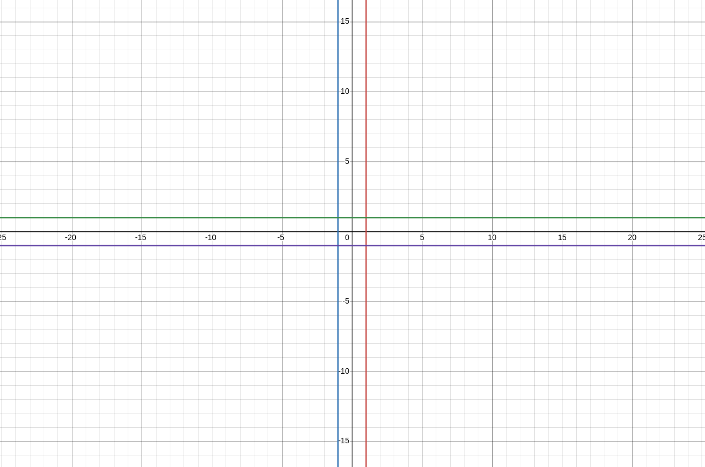

# 스승님 찾기

**실버 2**

|시간 제한	|메모리 제한|제출|정답|맞힌 사람|정답| 비율|
|---|---|---|---|---|---|---|
|1 초|	512 MB|	|1158|	329|	279	|29.936%|

## 문제

현욱은 옛날 자신에게 알고리즘을 가르쳐 준 스승님이 어느 신비로운 밀림 속 나무 아래에서 수행 중이라는 사실을 전해 들었다.

이 무한한 넓이의 밀림에는 모든 격자점(x, y 좌표가 모두 정수인 위치)마다 완전히 똑같은 모양의 나무가 한 그루씩 심어져 있고, 현욱의 스승은 그 중 (M,N) 좌표의 나무 아래에서 수행을 하고 있다.

이 밀림에는 또 다른 특징이 있는데, 어떤 나무 아래에서 볼 수 있는 다른 나무로 순간이동을 할 수 있다는 것이다. 어떤 나무 아래에서 다른 나무를 보려면, 그 두 나무의 좌표를 잇는 직선을 그었을 때 중간에 다른 나무가 존재하지 않아야 한다.

예를 들어, 현욱이 (0, 0) 위치에 있을 때 (1, 1) 위치에 있는 나무 혹은 (1,2) 위치에 있는 나무는 볼 수 있기 때문에 바로 순간이동 할 수 있다. 하지만 (2, 4) 위치에 있는 나무는 (1, 2) 위치에 있는 나무에 가려 보이지 않으므로 바로 순간이동 할 수 없다.

현욱은 수행을 돕기 위해 스승님이 있는 곳으로 가려고 한다. 하지만 밀림의 신비로운 기운으로 인해 나무 사이를 걸어서 이동하는 것은 위험할 수 있어서, 현욱은 순간이동만 이용해서 (M, N) 위치로 이동할 것이다. 또, 순간이동은 할 때마다 멀미가 심하게 나기 때문에 현욱은 최대한 적은 횟수만큼만 순간이동을 사용해서 (M, N) 위치로 이동하려고 한다.

이 밀림에 들어오는 모든 사람은 저절로 (0,0) 위치에 있는 나무 밑으로 이동하게 된다. 현욱을 도와 (0,0) 위치의 나무 아래에서 (M, N) 위치의 나무 아래로 이동하는 데 필요한 최소 순간이동 횟수를 구해보자.

## 입력

첫째 줄에 현욱의 스승이 있는 위치를 나타내는 두 정수 M, N이 주어진다.

## 출력

첫째 줄에 (M, N) 좌표로 이동하기 위해 필요한 최소 순간이동 횟수를 출력한다.

## 제한

- -10<sup>9 ≤ M, N ≤ 10<sup>9

## 서브태스크 1 (1점)

- N과 M은 동일하다

## 서브태스크 2 (2점)

- 추가 제한 없음 

## 예제 입력 1

```
2 4
```

## 예제 출력 1

```
2
```

## 문제 풀이

해당 문제는 유클리드 호제법을 사용하여 GCD를 확인하여 서로소인지 확인하는 문제로 판단하였다.

먼저, 크게 두가지 경우로 나눌 수 있다.

1. M == N인 경우
   1. M == N == 0 : 순간이동 횟수 0
   2. M == N == 1 or -1 : 순간이동 횟수 1
   3. -10<sup>9 ≤ M, N ≤ 10<sup>9 (단, M과 N은 0, -1, 1은 제외) : 순간이동 횟수 2

> 1번과 2번은 당연한 것이고 3번의 경우를 봐보면 다음과 같다.
> 
> |M|과 |N|이 1을 넘어간 시점에서 최소 2이상이든가 -2이하이다. 그렇다면, M과 N이 같은 경우 둘 중 아무거나 하나 선택해서 +1 혹은 -1을 해준다면 둘의 관계는 서로소 관계로 될 것이다.
> 
> 예시로 M에 + 1을 했다고 간주힌디면 순간이동 횟수는 (0,0) -> (M + 1, N) -> (M, N)으로 2번으로 이루어 질 것이다.
> > 여기서 추가적으로 설명을 달자면,
> > 
> > 서로소인 경우 순간이동 횟수가 1번 즉, (0,0)과 직선을 이었을 때 중간에 점이 하나도 없는 이유는 다음과 같다.
> 
> > 공약수가 1외에 없다는 것은 임의의 두 서로소 a, b보다 작은 어떠한 값(c라고 가정)으로 나누었을 때(동일한 비율로 직선 끝에서 중심으로 이동했을 때) **자연수로 떨어지는 수가 없다**는 이야기이다.
> >
> > 즉, **좌표 축에 (a/c, b/c)인 점이 존재하지 않다**는 이야기이다.
2. M != N인 경우
   1. M과 N이 서로소인 경우 : 순간이동 횟수 1
   2. M과 N이 서로소가 아닌 경우 : 순간이동 횟수 2
> 1번의 경우 서로소이기 때문에 (0,0)과 선을 이었을 때 중간에 점을 지나지 않는다.
> 
> 2번의 경우를 살펴보자.
> 
> 먼저 좌표축을 한번 들여다 볼 필요가 있다.
> 
> 
> 
> x = 1, x=  -1, y = 1, y = -1 해당 직선들 위에 있는 점들은 (0,0)과 이은 직선 사이에 점들이 존재하지 않는 점들이다. (서로소)
> 
> 그렇다면 임의의 두점 a, b가 있다고 가정해보자(이때, a, b는 일단 자연수로 가정). 여기서 (0,0)에서 (1,b-1)까지 한번에 선을 그을 수 있을 것이다. { (1, b+1) 이든 (a-1, 1)이든 상관없다. }
> 
> 그 이후, (1, b-1)를 원점으로 이동 시켜보면서 (a,b)도 같이 평행 이동시켜보자. x는 -1만큼 y는 b-1만큼 이동시키면 (0,0)과 (a-1, 1)로 이동할 것이다.
> 
> 즉, a-1과 1은 위에서 봤듯이 (0, 0)과 이은 직선 사이에 점들이 존재하지 않는 직선이니깐 이것을 평행이동 시킨 (1, b-1)과 (a, b)를 이은 직선도 중간에 점이 존재하지 않는다.

> M과 N이 음수도 가능하다는 것에 주의
## 나의 코드

**AC**

```java
import java.io.BufferedReader;
import java.io.IOException;
import java.io.InputStreamReader;
import java.util.StringTokenizer;

public class Main {
  public static void main(String[] args) throws IOException {
    BufferedReader br = new BufferedReader(new InputStreamReader(System.in));
    StringTokenizer st = new StringTokenizer(br.readLine());

    // M , N
    int M = Math.abs(Integer.parseInt(st.nextToken()));
    int N = Math.abs(Integer.parseInt(st.nextToken()));

    // Case 1
    if(M == N) {
      if(M == 0) System.out.println(0);
      else if(M == 1 || M == -1) System.out.println(1);
      else System.out.println(2);
    }
    else {
      if(euclidean(M, N)) System.out.println(1);
      else System.out.println(2);
    }


  }
  static boolean euclidean(int x, int y) {
    if(y == 0) {
      if(x <= 1)
        return true;
      else
        return false;
    }
    return euclidean(y, x % y);
  }
}

```