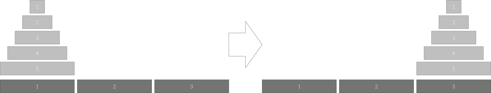

# 하노이 탑

**실버 1**

|시간 제한|	메모리 제한|	제출	|정답|	맞힌 사람	|정답 비율|
|---|---|---|---|---|---|
|6 초	|128 MB|	23161|	4818	|3715|	23.980%|

## 문제 

세 개의 장대가 있고 첫 번째 장대에는 반경이 서로 다른 n개의 원판이 쌓여 있다. 각 원판은 반경이 큰 순서대로 쌓여있다. 이제 수도승들이 다음 규칙에 따라 첫 번째 장대에서 세 번째 장대로 옮기려 한다.

1. 한 번에 한 개의 원판만을 다른 탑으로 옮길 수 있다.
2. 쌓아 놓은 원판은 항상 위의 것이 아래의 것보다 작아야 한다.
이 작업을 수행하는데 필요한 이동 순서를 출력하는 프로그램을 작성하라. 단, 이동 횟수는 최소가 되어야 한다.

아래 그림은 원판이 5개인 경우의 예시이다.



## 입력

첫째 줄에 첫 번째 장대에 쌓인 원판의 개수 N (1 ≤ N ≤ 100)이 주어진다.

## 출력

첫째 줄에 옮긴 횟수 K를 출력한다.

N이 20 이하인 입력에 대해서는 두 번째 줄부터 수행 과정을 출력한다. 두 번째 줄부터 K개의 줄에 걸쳐 두 정수 A B를 빈칸을 사이에 두고 출력하는데, 이는 A번째 탑의 가장 위에 있는 원판을 B번째 탑의 가장 위로 옮긴다는 뜻이다. N이 20보다 큰 경우에는 과정은 출력할 필요가 없다.

## 예제 입력 1

```
3
```

## 예제 출력 1

```
7
1 3
1 2
3 2
1 3
2 1
2 3
1 3
```

## 문제 풀이

해당 문제는 **'그룹'** 이라는 개념이 매우 중요하게 작용한다.

원반 4개를 옮긴다고 가정해보자.

가장밑의 원반(4)이 1에서 3으로 가려면 원반 1, 2와 3은 어디로 가야할까? 

원반 1, 2와 3은 2로 가야한다.

원반 3이 2로 가기 위해선 1과 2는 어디로 가야할까?

3으로 가야한다.

원반 1, 2가 3으로 가기 위해선 1은 어디로 가야할까? 2로 가야한다.

같은 과정이 반복되는 것 같다.

즉, 원반 4개일 때는 원반 1,2,3이 **그룹**이고 원반 3개일 땐 원반 1,2가 **그룹**이고 원반이 2개일 때는 원반 1이 **그룹**인 것이다.

## 나의 코드

```java
import java.io.*;
import java.math.BigInteger;
import java.util.ArrayList;
import java.util.StringTokenizer;

public class Main {
  static long count = 0;
  static BigInteger bigCount;
  static boolean print;
  static ArrayList<String> printList;
  public static void main(String[] args) throws IOException {
    BufferedReader br = new BufferedReader(new InputStreamReader(System.in));
    BufferedWriter bw = new BufferedWriter(new OutputStreamWriter(System.out));

    // 원판의 개수
    int N = Integer.parseInt(br.readLine());

    printList = new ArrayList<>();
    print = false;
    if(N <= 20) print = true;
    if(print) {
      hanoi(N, 1, 3);
    }
    else {
      bigCount = BigInteger.valueOf(2);
      bigCount = bigCount.pow(N).subtract(new BigInteger("1"));
    }
    if(print){
      bw.write(count+"\n");
      bw.flush();
      for(String str : printList) bw.write(str+"\n");
      bw.flush();
      bw.close();
    }
    else {
      bw.write(bigCount+"\n");
      bw.flush();
      bw.close();
    }
  }
  static void hanoi(int N, int src, int dest) {
    count++;
    if(N > 1){
      hanoi(N-1, src, 6- dest - src);
    }
    printList.add(src + " " + dest);
    if(N > 1) {
      hanoi(N -1, 6 - dest - src, dest);
    }
  }
}
```

## 참고한 사이트

- [[JAVA] #28 BigInteger 클래스 정리 :: 굳건하게](https://travelbeeee.tistory.com/465)
- [코딩의 시작, TCP School](http://www.tcpschool.com/java/java_datatype_basic)
- [하노이탑 공식 정리](https://skmagic.tistory.com/257)