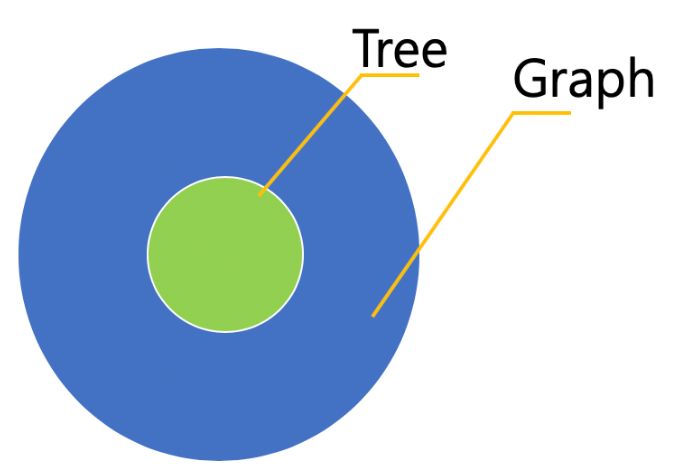
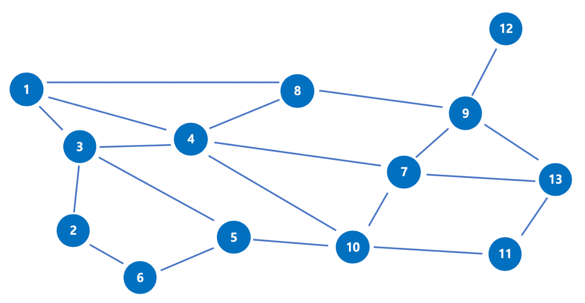

# 탐색 알고리즘

## 설명

**탐색 알고리즘**를 정리 해둔 저장소이다.

해당 탐색 알고리즘들을 공부할 예정이다.

1. Linear Search Algorithm
2. Binary Search Algorithm
3. Binary Search Tree
4. Exhaustive Search(완전 탐색)
5. DFS Algorithm(Depth-Fisrt Search)
6. BFS Algorithm(Breadth-First Search)
7. Dijkstra Algorithm
8. Bellman-Ford Algorithm
9. Floyd Warshell Algorithm

이렇게 총 **9가지 알고리즘들**을 각각 정리할 예정이다.

먼저 해당 알고리즘을 공부하기 이전에 알아둬야할 개념들을 여기에 정리해 둘 예정이다.

해당 내용들은 **구글링**과 **블로그**를 참고하여 작성하였고, 현재 나에게 필요한 부분만 정리하여 적고, 나머지는 기존 원문 링크를 달아놓을 것이다.

## Time Complexity(시간 복잡도)

### ❗시간복잡도

> 알고리즘의 로직을 코드로 구현할 때, **시간복잡도를 고려한다는 것**은 **입력값의 변화에 따라 연산을 실행할 때, 연산 횟수에 비해 시간이 얼마나 걸리는가?** 를 의미한다.

즉, 입력값의 변화에 따라 얼마만큼 시간의 변화가 생기는 것인가에 초점을 두면 된다.

- **효율적인 알고리즘을 구현한다는 것**은 바꾸어 말해 **입력값이 커짐에 따라 증가하는 시간의 비율을 최소화한 알고리즘**을 구성했다는 이야기이다.
- 그리고 이 **시간 복잡도**는 주로 **빅-오 표기법**을 사용해 나타낸다.

### ❗Big-O 표기법

👉 **시간 복잡도를 표기하는 방법**

- Big-O(빅-오) ⇒ 상한 점근
- Big-Ω(빅-오메가) ⇒ 하한 점근
- Big-θ(빅-세타) ⇒ 그 둘의 평균
- 위 세 가지 표기법은 시간 복잡도를 각각 최악, 최선, 중간(평균)의 경우에 대하여 나타내는 방법이다.

👉 **가장 자주 사용되는 표기법은?**

**Big-O 표기법**

- **빅오 표기법**은 **최악의 경우를 고려**하므로, 프로그램이 실행되는 과정에서 소요되는 **최악의 시간까지 고려**할 수 있기 때문이다.
- “최소한 특정 시간 이상이 걸린다” 혹은 “이 정도 시간이 걸린다”를 고려하는 것보다 **“이 정도 시간까지 걸릴 수 있다”** 를 고려해야 그에 맞는 대응이 가능하다.

👉 **Big-O 표기법의 종류**

1. **O(1)**
2. **O(n)**
3. **O(log n)**
4. **O(n2)**
5. **O(2n)**

👉 **참고한 사이트**

- [[알고리즘] Time Complexity (시간 복잡도) - 하나몬](https://hanamon.kr/%EC%95%8C%EA%B3%A0%EB%A6%AC%EC%A6%98-time-complexity-%EC%8B%9C%EA%B0%84-%EB%B3%B5%EC%9E%A1%EB%8F%84/)
- [시간복잡도와 공간복잡도(Time Complexity Space Complexity)](https://madplay.github.io/post/time-complexity-space-complexity)

## 그래프와 트리(Graph, Tree)

### ❗그래프(Graph)

👉 **그래프란?**

**그래프**는 노드(하나의 점)와 노드 간을 연결하는 간선으로 구성된 자료 구조이다.
이를 통해 연결된 노드 간의 관계를 표현할 수 있는 자료구조이다.

사실 그래프에서는 **노드**를 **Vertex**로 표현하고, **간선**을 **Bellman_Ford_Algorithm.Main.Edge**로 표현한다.

그래프(G) = 정점 집합(V) + 간선 집합(E)
수학적으로 그래프를 **G = (V, E)**와 같이 표현

👉 **그래프의 특징**

- 그래프는 순환 혹은 비순환 구조를 이룬다.
- 그래프는 방향이 있는 그래프와 방향이 없는 그래프가 있다.
- 루트 노드의 개념이 없다 / 부모-자식 관계라는 개념이 없다.
- 2개 이상의 경로가 가능(무방향, 방향, 양방향)
- 그래프는 네트워크 모델이다.

### ❗트리(Tree)

👉 **트리란?**

트리는 그래프와 같이 노드와 노드간을 연결하는 간선으로 구성된 자료구조이다.

그러나 트리는 그래프 중에서도 특수한 케이스에 해당하는 자료구조이다.

트리는 **두 개의 노드 사이에 반드시 1개의 경로만을 가지며 사이클이 존재하지 않는 방향 그래프이다.**

이러한 특성 떄문에 **최소 연결 트리**라고 부르기도 한다.

부모-자식 관계가 성립하기 때문에 계층형 모델이라고도 한다.

👉 **트리의 특징**

- 부모-자식 관계까 존재해 레벨이 존재한다.(최상위 노드 = Root)
- 노드가 N개이면 간선은 N-1개 / 각 레벨 k에 존재하는 노드는 2^k개
- 방향성이 존재하고 사잌틀은 존재하지 않는다.(비순환)
- 트리의 순회는 전위순회, 중위순회, 후위순회 3가지가 존재한다.

👉 **트리와 그래프 비교**

|           | 그래프                 | 트리                      |
| --------- | ---------------------- | ------------------------- |
| 방향성    | 방향, 무방향           | 방향만                    |
| 사이클    | 순환, 비순환, 자기순환 | 비순환만                  |
| 루트노드  | 루트 개념 없음         | 한 개의 루트 존재         |
| 부모-자식 | 부모-자식 개념없음     | 1개의 부모노드(루트 제외) |
| 모델      | 네트워크 모델          | 계층 모델                 |
| 간선 수   | 자유                   | N-1개                     |

👉 **참고한 사이트**

- [[자료구조] 그래프와 트리(Graph, Tree)](https://bigsong.tistory.com/33)
