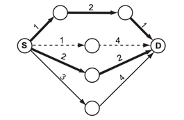

# 거의 최단 경로

|시간 제한|	메모리 제한|	제출	|정답	맞힌 사람|	정답 비율|
|---|---|---|---|---|
|1 초|	256 MB|	22043	3715|	2264|	19.266%|

**나의 시도 횟수: 16회**

## 문쪠

요즘 많은 자동차에서는 GPS 네비게이션 장비가 설치되어 있다. 네비게이션은 사용자가 입력한 출발점과 도착점 사이의 최단 경로를 검색해 준다. 하지만, 교통 상황을 고려하지 않고 최단 경로를 검색하는 경우에는 극심한 교통 정체를 경험할 수 있다.

상근이는 오직 자기 자신만 사용 가능한 네비게이션을 만들고 있다. 이 네비게이션은 절대로 최단 경로를 찾아주지 않는다. 항상 거의 최단 경로를 찾아준다.

거의 최단 경로란 최단 경로에 포함되지 않는 도로로만 이루어진 경로 중 가장 짧은 것을 말한다.

예를 들어, 도로 지도가 아래와 같을 때를 생각해보자. 원은 장소를 의미하고, 선은 단방향 도로를 나타낸다. 시작점은 S, 도착점은 D로 표시되어 있다. 굵은 선은 최단 경로를 나타낸다. (아래 그림에 최단 경로는 두 개가 있다)거의 최단 경로는 점선으로 표시된 경로이다. 이 경로는 최단 경로에 포함되지 않은 도로로 이루어진 경로 중 가장 짧은 경로이다. 거의 최단 경로는 여러 개 존재할 수도 있다. 예를 들어, 아래 그림의 길이가 3인 도로의 길이가 1이라면, 거의 최단 경로는 두 개가 된다. 또, 거의 최단 경로가 없는 경우도 있다.



## 입력

입력은 여러 개의 테스트 케이스로 이루어져 있다. 각 테스트 케이스의 첫째 줄에는 장소의 수 N (2 ≤ N ≤ 500)과 도로의 수 M (1 ≤ M ≤ 104)가 주어진다. 장소는 0부터 N-1번까지 번호가 매겨져 있다. 둘째 줄에는 시작점 S와 도착점 D가 주어진다. (S ≠ D; 0 ≤ S, D < N) 다음 M개 줄에는 도로의 정보 U, V, P가 주어진다. (U ≠ V ; 0 ≤ U, V < N; 1 ≤ P ≤ 103) 이 뜻은 U에서 V로 가는 도로의 길이가 P라는 뜻이다. U에서 V로 가는 도로는 최대 한 개이다. 또, U에서 V로 가는 도로와 V에서 U로 가는 도로는 다른 도로이다.

입력의 마지막 줄에는 0이 두 개 주어진다.

## 출력

각 테스트 케이스에 대해서, 거의 최단 경로의 길이를 출력한다. 만약, 거의 최단 경로가 없는 경우에는 -1을 출력한다.

## 예제 입력 1
```
7 9
0 6
0 1 1
0 2 1
0 3 2
0 4 3
1 5 2
2 6 4
3 6 2
4 6 4
5 6 1
4 6
0 2
0 1 1
1 2 1
1 3 1
3 2 1
2 0 3
3 0 2
6 8
0 1
0 1 1
0 2 2
0 3 3
2 5 3
3 4 2
4 1 1
5 1 1
3 0 1
0 0
```

## 예제 출력1
```
5
-1
6
```

## 나의 코드 오류
```java
import java.io.BufferedReader;
import java.io.IOException;
import java.io.InputStreamReader;
import java.util.*;

class Node {
  int idx;
  int cost;

  Node(int idx, int cost) {
    this.idx = idx;
    this.cost = cost;
  }
}

class TargetNode {
  int startNode, endNode, cost;

  TargetNode(int startNode, int endNode, int cost) {
    this.startNode = startNode;
    this.endNode = endNode;
    this.cost = cost;
  }
}
public class Main {
  static int INF = Integer.MAX_VALUE;

  public static void main(String[] args) throws IOException {
    while(true) {
      BufferedReader br = new BufferedReader(new InputStreamReader(System.in));
      StringTokenizer st = new StringTokenizer(br.readLine());

      // Edge, Vertex 입력 받기
      int N = Integer.parseInt(st.nextToken());
      int M = Integer.parseInt(st.nextToken());

      if(N == 0 && M == 0) break;

      // 시작 Node와 도착 Node 입력받기
      st = new StringTokenizer(br.readLine());
      int start = Integer.parseInt(st.nextToken());
      int end = Integer.parseInt(st.nextToken());

      // graph 초기화
      ArrayList<ArrayList<Node>> graph = new ArrayList<>();
      for(int i = 0; i < N; i++) {
        graph.add(new ArrayList<>());
      }

      // 종착지 바로 전 Node를 저장할 List 생성
      ArrayList<TargetNode> target = new ArrayList<>();

      // 간선 정보 입력받기
      for(int i = 0; i < M; i++) {
        st = new StringTokenizer(br.readLine());

        int node1 = Integer.parseInt(st.nextToken());
        int node2 = Integer.parseInt(st.nextToken());
        int cost = Integer.parseInt(st.nextToken());

        if(node1 != end)
          graph.get(node1).add(new Node(node2, cost));

        if(node2 == end) {
          target.add(new TargetNode(node1, node2, cost));
        }
      }

      // Distance Table 초기화
      int[] dist = new int[N];
      Arrays.fill(dist, INF);
      dist[start] = 0;
      dist[end] = -1;

      Dijkstra(graph, dist, start, end);

      // 종착지까지의 거리값들을 넣어줄 List 생성
      ArrayList<Integer> distance = new ArrayList<>();

      // target List를 활용화여 종착지까지의 거리 계산
      for(int i = 0; i < target.size(); i++) {
        distance.add(dist[target.get(i).startNode] + target.get(i).cost);
      }
      // distance가 0 혹은 1일 경우 -1 출력 후 종료
      if(distance.size() <= 1) {
        System.out.println(-1);
        continue;
      }

      Collections.sort(distance);

      int shortest = distance.get(0);
      for(int i = 1; i < distance.size(); i++) {
        if(distance.get(i) > shortest) {
          System.out.println(distance.get(i));
          break;
        }
      }
    }
  }
  static void Dijkstra(ArrayList<ArrayList<Node>> graph, int[] dist, int start, int end) {
    PriorityQueue<Node> q = new PriorityQueue<>((o1, o2) -> Integer.compare(o1.cost, o2.cost));

    q.add(new Node(start, 0));

    while (!q.isEmpty()) {
      Node curNode = q.poll();

      if(dist[curNode.idx] < curNode.cost) continue;

      for(int i = 0; i < graph.get(curNode.idx).size(); i++) {
        Node adjNode = graph.get(curNode.idx).get(i);

        // 종착지까지의 거리는 최신화 X
        if(adjNode.idx == end) continue;

        // 종착지 직전까지의 Node만 최소 거리 계산
        if(dist[adjNode.idx] > curNode.cost + adjNode.cost) {
          dist[adjNode.idx] = curNode.cost + adjNode.cost;
          q.add(new Node(adjNode.idx, dist[adjNode.idx]));
        }
      }
    }

  }
}
```

해당과 같이 풀이를 했지만, 문제를 잘 못 이해한 것이다.

해당 문제에서 주어지는 거의 최단 경로는 최단 경로에 포함되지 않는 도로로만 이루어진 경로 중 가장 짧은 것을 요구한다.

또한, 내가 하려고 했던 두번째 풀이료 모든 경로를 파악하면서 거리를 계산하는 방식도 적합하지 않을 것 같다.

이것은 DFS를 활용하여 종착지에 도착을 했을 경우 path와 distance가 담긴 객체를 List에 넣어주는 재귀 함수를 활용하려고 했다.

## Test Case

**Case 1**

중복 간선이 있는 경우 
```java
4 5
0 2
0 1 1
0 3 5
1 2 2
1 3 1
3 2 1
```

**Case 2**

중복되는 최단 경로에서 서로 다른 두 경로가 도착지가 아닌 노드에 도달하고 그 거리가 같을 경우
```java
5 6
0 4
0 1 10
0 2 1
2 1 2
1 3 1
3 4 2
1 4 5
0 0
```
해당 경우는 최단 경로가 3개가 나오는 경우로 간선이 하나 제외하고 다 지워져야 정상적으로 작동한다. 

## 코드 오류 

```java
import java.io.BufferedReader;
import java.io.IOException;
import java.io.InputStreamReader;
import java.util.ArrayList;
import java.util.Arrays;
import java.util.PriorityQueue;
import java.util.StringTokenizer;

class Node {
  int idx;
  int cost;
  ArrayList<Integer> path;

  Node (int idx, int cost) {
    this.idx = idx;
    this.cost = cost;
  }

  Node(int idx, int cost, ArrayList<Integer> path) {
    this.idx = idx;
    this.cost = cost;
    this.path = path;
  }

}
public class Main {
  static int INF = Integer.MAX_VALUE;

  public static void main(String[] args) throws IOException {
    while (true) {
      BufferedReader br = new BufferedReader(new InputStreamReader(System.in));
      StringTokenizer st = new StringTokenizer(br.readLine());

      // 노드와 간선 입력 받기
      int N = Integer.parseInt(st.nextToken());
      int M = Integer.parseInt(st.nextToken());

      if(M == 0 && N == 0) break;

      // 시작점과 도착점 입력 받기
      st = new StringTokenizer(br.readLine());
      int start = Integer.parseInt(st.nextToken());
      int end = Integer.parseInt(st.nextToken());

      // 그래프 초기화
      ArrayList<ArrayList<Node>> graph = new ArrayList<>();
      for (int i = 0; i < N; i++) {
        graph.add(new ArrayList<>());
      }

      // 모든 간선 정보 입력 받기
      for (int i = 0; i < M; i++) {
        st = new StringTokenizer(br.readLine());
        int node1 = Integer.parseInt(st.nextToken());
        int node2 = Integer.parseInt(st.nextToken());
        int cost = Integer.parseInt(st.nextToken());

        // 단방향 그래프
        graph.get(node1).add(new Node(node2, cost));
      }

      int[] dist = new int[N];

      Dijkstra(start, end, dist, graph, 0);

      int answer = Dijkstra(start, end, dist, graph, 1);

      System.out.println(answer);
    }
  }
  static int Dijkstra(int start, int end, int[] dist, ArrayList<ArrayList<Node>> graph, int version){
    Arrays.fill(dist, INF);
    dist[start] = 0;

    PriorityQueue<Node> q = new PriorityQueue<>((o1, o2) -> Integer.compare(o1.cost, o2.cost));

    ArrayList<Integer> startPath = new ArrayList<>();
    startPath.add(start);
    q.add(new Node(start, 0,  startPath));

    int shortestDistance = -1;
    while (!q.isEmpty()) {
      Node curNode = q.poll();

      // 도착지까지 가는 모든 경로 실행 방지
      if(dist[curNode.idx] == curNode.cost && curNode.idx == end) {
        if(version == 0) {
          removeShortestPath(curNode, graph);
        }
        // 최단 경로가 여러 개 일 수 있기 때문에 return 사용 X
        shortestDistance = dist[curNode.idx];
      }

      if(dist[curNode.idx] < curNode.cost) continue;

      for(int i = 0; i < graph.get(curNode.idx).size(); i++) {
        Node adjNode = graph.get(curNode.idx).get(i);

        if(dist[adjNode.idx] > curNode.cost + adjNode.cost) {
          dist[adjNode.idx] = curNode.cost + adjNode.cost;
          // ArrayList는 주소지를 주고 받기 때문에 새로운 주소지이면서 내용물은 같게 해주는 clone()을 활용
          ArrayList<Integer> path = (ArrayList<Integer>)curNode.path.clone();
          path.add(adjNode.idx);
          q.add(new Node(adjNode.idx, dist[adjNode.idx], path));
        }
        // 만약 동일한 경로가 두개라면 거리 테이블과 값이 같을 것이기 때문에 위의 경우가 실행되지 않는다.
        // 위에서 = 을 추가하지 않은 것은 도착지 이외의 경로가 실행되는 것을 방지하기 위함
        else if(adjNode.idx == end && dist[adjNode.idx] == curNode.cost + adjNode.cost) {
          ArrayList<Integer> path = (ArrayList<Integer>)curNode.path.clone();
          path.add(adjNode.idx);
          q.add(new Node(adjNode.idx, dist[adjNode.idx], path));
        }
      }
    }
    return shortestDistance;
  }
  static void removeShortestPath(Node node, ArrayList<ArrayList<Node>> graph) {
    ArrayList<Integer> path = node.path;

    while (path.size() > 1) {
      // 시작점을 기준으로 도착지를 비교해서 간선 제거
      for(int i = 0 ; i < graph.get(path.get(0)).size(); i++) {
        if(path.get(1) == graph.get(path.get(0)).get(i).idx) {
          graph.get(path.get(0)).remove(i);
          path.remove(0);
          break;
        }
        // 최단 경로 간선이 종복되어 있는 경우 중복된 간선이 이미 지워져서 찾을 수 없는 경우
        else if(i == graph.get(path.get(0)).size() - 1) path.remove(0);
      }
    }

  }
}
```

해당 코드에서 

```java
        else if(adjNode.idx == end && dist[adjNode.idx] == curNode.cost + adjNode.cost) {
          ArrayList<Integer> path = (ArrayList<Integer>)curNode.path.clone();
          path.add(adjNode.idx);
          q.add(new Node(adjNode.idx, dist[adjNode.idx], path));
        }
```

이부분은 Case2 때문에 불필요한 코드다.

```java
  public static void main(String[] args) throws IOException {
    BufferedReader br = new BufferedReader(new InputStreamReader(System.in));
```
백준 문제 풀 때 이와 같이 **BufferedReacer**는 따로 빼줘야 정상적으로 작동한다.

while문 안에 넣지 않아야 됨을 주의하자.

```java
import java.io.BufferedReader;
import java.io.IOException;
import java.io.InputStreamReader;
import java.util.ArrayList;
import java.util.Arrays;
import java.util.PriorityQueue;
import java.util.StringTokenizer;

class Node {
  int idx;
  int cost;
  ArrayList<Integer> path;

  Node (int idx, int cost) {
    this.idx = idx;
    this.cost = cost;
  }

  Node(int idx, int cost, ArrayList<Integer> path) {
    this.idx = idx;
    this.cost = cost;
    this.path = path;
  }

}
public class Main {
  static int INF = Integer.MAX_VALUE;

  public static void main(String[] args) throws IOException {
    BufferedReader br = new BufferedReader(new InputStreamReader(System.in));
    while (true) {
      StringTokenizer st = new StringTokenizer(br.readLine());

      // 노드와 간선 입력 받기
      int N = Integer.parseInt(st.nextToken());
      int M = Integer.parseInt(st.nextToken());

      if(M == 0 && N == 0) break;

      // 시작점과 도착점 입력 받기
      st = new StringTokenizer(br.readLine());
      int start = Integer.parseInt(st.nextToken());
      int end = Integer.parseInt(st.nextToken());

      // 그래프 초기화
      ArrayList<ArrayList<Node>> graph = new ArrayList<>();
      for (int i = 0; i < N; i++) {
        graph.add(new ArrayList<>());
      }

      // 모든 간선 정보 입력 받기
      for (int i = 0; i < M; i++) {
        st = new StringTokenizer(br.readLine());
        int node1 = Integer.parseInt(st.nextToken());
        int node2 = Integer.parseInt(st.nextToken());
        int cost = Integer.parseInt(st.nextToken());

        // 단방향 그래프
        graph.get(node1).add(new Node(node2, cost));
      }

      int[] dist = new int[N];

      Dijkstra(start, end, dist, graph, 0);

      int answer = Dijkstra(start, end, dist, graph, 1);

      System.out.println(answer);
    }
  }
  static int Dijkstra(int start, int end, int[] dist, ArrayList<ArrayList<Node>> graph, int version){
    Arrays.fill(dist, INF);
    dist[start] = 0;

    PriorityQueue<Node> q = new PriorityQueue<>((o1, o2) -> Integer.compare(o1.cost, o2.cost));

    ArrayList<Integer> startPath = new ArrayList<>();
    startPath.add(start);
    q.add(new Node(start, 0,  startPath));

    int shortestDistance = -1;
    while (!q.isEmpty()) {
      Node curNode = q.poll();

      // 도착지까지 가는 모든 경로 실행 방지
      if(dist[curNode.idx] == curNode.cost && curNode.idx == end) {
        if(version == 0) {
          removeShortestPath(curNode, graph);
        }
        // 최단 경로가 여러 개 일 수 있기 때문에 return 사용 X
        shortestDistance = dist[curNode.idx];
      }

      if(dist[curNode.idx] < curNode.cost) continue;

      for(int i = 0; i < graph.get(curNode.idx).size(); i++) {
        Node adjNode = graph.get(curNode.idx).get(i);

        // 최단경로에서 종착지만 생각하는 것이 아닌 도착지 이전 노드의 최단경로가 두개인 경우도 고려
        if(dist[adjNode.idx] >= curNode.cost + adjNode.cost) {
          dist[adjNode.idx] = curNode.cost + adjNode.cost;
          // ArrayList는 주소지를 주고 받기 때문에 새로운 주소지이면서 내용물은 같게 해주는 clone()을 활용
          ArrayList<Integer> path = (ArrayList<Integer>)curNode.path.clone();
          path.add(adjNode.idx);
          q.add(new Node(adjNode.idx, dist[adjNode.idx], path));
        }
      }
    }
    return shortestDistance;
  }
  static void removeShortestPath(Node node, ArrayList<ArrayList<Node>> graph) {
    ArrayList<Integer> path = node.path;

    while (path.size() > 1) {

      // 해당 노드에 이미 간선이 전부 제거된 경우
      if(graph.get(path.get(0)).size() == 0) path.remove(0);
      // 시작점을 기준으로 도착지를 비교해서 간선 제거
      for(int i = 0 ; i < graph.get(path.get(0)).size(); i++) {
        if(path.get(1) == graph.get(path.get(0)).get(i).idx) {
          graph.get(path.get(0)).remove(i);
          path.remove(0);
          break;
        }
        // 최단 경로 간선이 종복되어 있는 경우 중복된 간선이 이미 지워져서 찾을 수 없는 경우
        else if(i == graph.get(path.get(0)).size() - 1) path.remove(0);
      }
    }

  }
}
```

**결과: MLE**

해당 코드는 결국에는 Dijkstra를 실행하면서 Distance Table이 바뀔 때 마다의 모든 경로를 저장하는 방식이기 때문에 많은 메모리를 잡아 먹을 수 밖에 없다.

즉, 모든 최단 경로의 추적은 가능하지만, 원하는 노드까지의 최단 경로 추적외에도 전부 탐색하기 때문에 적합하지 않은 코드다.

```java
import java.io.BufferedReader;
import java.io.IOException;
import java.io.InputStreamReader;
import java.util.*;

class Node {
  int idx;
  int cost;

  Node(int idx, int cost) {
    this.idx = idx;
    this.cost = cost;
  }
}
public class Main {
  static int INF = Integer.MAX_VALUE;

  static ArrayList<Node> path = new ArrayList<>();
  static Set<Node> shortestPath = new LinkedHashSet<>();

  public static void main(String[] args) throws IOException {
    BufferedReader br = new BufferedReader(new InputStreamReader(System.in));
    StringTokenizer st = new StringTokenizer(br.readLine());

    // 노드와 간선 입력 받기
    int N = Integer.parseInt(st.nextToken());
    int M = Integer.parseInt(st.nextToken());

    // 시작점과 도착점 입력 받기
    st = new StringTokenizer(br.readLine());
    int start = Integer.parseInt(st.nextToken());
    int end = Integer.parseInt(st.nextToken());

    // 간선 넣어줄 그래프 생성
    ArrayList<ArrayList<Node>> graph = new ArrayList<>();
    for(int i = 0; i < N; i++) {
      graph.add(new ArrayList<>());
    }

    // 간선 입력 받기
    for(int i = 0; i < M; i++) {
      st = new StringTokenizer(br.readLine());
      int node1 = Integer.parseInt(st.nextToken());
      int node2 = Integer.parseInt(st.nextToken());
      int cost = Integer.parseInt(st.nextToken());

      // 단방향 그래프
      graph.get(node1).add(new Node(node2, cost));
    }

    int[] dist = new int[N];

    Dijkstra(start, end, dist, graph, 0);

    checkVertex(start, end, dist, graph, 0);

    removeVertex(shortestPath, graph);

    Dijkstra(start, end, dist, graph, 1);

  }
  static void Dijkstra(int start, int end, int[] dist, ArrayList<ArrayList<Node>> graph, int version) {
    dist[start] = 0;

    PriorityQueue<Node> q = new PriorityQueue<>((o1, o2) -> Integer.compare(o1.cost, o2.cost));

    q.add(new Node(start, 0));

    while (!q.isEmpty()) {
      Node curNode = q.poll();

      if(curNode.idx == end)  {
        if(version == 1) {
          System.out.println(dist[curNode.cost] != INF ? dist[curNode.cost] : -1);
        }
        return;
      }

      if(dist[curNode.idx] < curNode.cost) continue;;

      for(int i = 0; i < graph.get(curNode.idx).size(); i++) {
        Node adjNode = graph.get(curNode.idx).get(i);

        if(dist[adjNode.idx] < curNode.cost + adjNode.cost) {
          dist[adjNode.idx] = curNode.cost + adjNode.cost;

          q.add(new Node(adjNode.idx, dist[adjNode.idx]));
        }
      }
    }
  }
  static void checkVertex(int curNodeIdx, int end, int[] dist, ArrayList<ArrayList<Node>> graph, int distance) {
    // DFS 사용
    // 경로 추적할 ArrayList와 삭제할 간선을 저장해둘 Set 둘 다 이용

    if(curNodeIdx == end && dist[curNodeIdx] == distance) {
      for(int i = 0; i < path.size(); i++) {
        shortestPath.add(path.get(i));
      }
    }

    for(Node nxtNode : graph.get(curNodeIdx)) {
      path.add(nxtNode);
      checkVertex(nxtNode.idx, end, dist, graph, distance + nxtNode.cost);
      path.remove(nxtNode);
    }
  }
  static void removeVertex(Set<Node> shortestPath, ArrayList<ArrayList<Node>> graph) {
    Iterator<Node> node = shortestPath.iterator();
    while (!node.hasNext()) {
      Node removeNode = node.next();
      // 이중 ArrayList 이지만 되는지 의문
      graph.remove(removeNode);
    }
  }
}
```

해당 코드는 Dijkstra로 최단 경로의 거리를 찾아내고 DFS를 활용하여 최단 경로 거리와 비교해 경로를 지우고나서 다시 Dijkstra를 활용하려고 한 코드이다.

여기서 Set을 활용해서 최단 경로를 넣어주려고 했지만 이 부분에서 오류가 있다.

현재 나는 graph에 간선을 넣어줄 때 ArrayList로 해서 넣어주었고, 이것은 시작점을 Index로 활용한 코드이다. 그래서 시작점을 알 수가 없다.

일단은 급하게 시작 index를 넣어서 해결하였지만 코드가 난잡해 보인다.

```java
class Node {
  int s;
  int idx;
  int cost;

  Node(int s, int idx, int cost) {
    this.s = s;
    this.idx = idx;
    this.cost = cost;
  }
}
```

아래의 코드를 살펴보자.

```java
  static void checkVertex(int curNodeIdx, int end, int[] dist, ArrayList<ArrayList<Node>> graph, int distance) {
    // DFS 사용
    // 경로 추적할 ArrayList와 삭제할 간선을 저장해둘 Set 둘 다 이용

    if(curNodeIdx == end && dist[curNodeIdx] == distance) {
      for(int i = 0; i < path.size(); i++) {
        shortestPath.add(path.get(i));
      }
    }

    for(Node nxtNode : graph.get(curNodeIdx)) {
      path.add(nxtNode);
      checkVertex(nxtNode.idx, end, dist, graph, distance + nxtNode.cost);
      path.remove(nxtNode);
    }
  }
```

해당 코드는 예제 첫번째 것을 입력했을 때 출력 5로 정확하게 나왔지만, 

문제는 그래프가 순환한다고 생각했을 때 문제가 발생한다. 즉, 두번째 예제를 보면 알 수 있다.

```java
import java.io.BufferedReader;
import java.io.IOException;
import java.io.InputStreamReader;
import java.lang.reflect.Array;
import java.util.*;

class Node {
  int s;
  int idx;
  int cost;

  Node(int s, int idx, int cost) {
    this.s = s;
    this.idx = idx;
    this.cost = cost;
  }
}

public class Main {
  static int INF = Integer.MAX_VALUE;

  static ArrayList<Node> path;
  static Set<Node> shortestPath;

  public static void main(String[] args) throws IOException {
    BufferedReader br = new BufferedReader(new InputStreamReader(System.in));
    StringTokenizer st;
    while (true) {
      st = new StringTokenizer(br.readLine());

      // 노드와 간선 입력 받기
      int N = Integer.parseInt(st.nextToken());
      int M = Integer.parseInt(st.nextToken());

      if(M == 0 && N == 0) break;

      // 시작점과 도착점 입력 받기
      st = new StringTokenizer(br.readLine());
      int start = Integer.parseInt(st.nextToken());
      int end = Integer.parseInt(st.nextToken());

      // 간선 넣어줄 그래프 생성
      ArrayList<ArrayList<Node>> graph = new ArrayList<>();
      for(int i = 0; i < N; i++) {
        graph.add(new ArrayList<>());
      }

      // 간선 입력 받기
      for(int i = 0; i < M; i++) {
        st = new StringTokenizer(br.readLine());
        int node1 = Integer.parseInt(st.nextToken());
        int node2 = Integer.parseInt(st.nextToken());
        int cost = Integer.parseInt(st.nextToken());

        // 단방향 그래프
        graph.get(node1).add(new Node(node1, node2, cost));
      }

      path = new ArrayList<>();
      shortestPath = new LinkedHashSet<>();

      int[] dist = new int[N];

      Dijkstra(start, end, dist, graph, 0);

      boolean[] isVisited = new boolean[N];
      isVisited[start] = true;

      checkVertex(start, end, dist, graph, 0, isVisited);

      removeVertex(shortestPath, graph);

      Dijkstra(start, end, dist, graph, 1);

    }
  }
  static void Dijkstra(int start, int end, int[] dist, ArrayList<ArrayList<Node>> graph, int version) {
    Arrays.fill(dist, INF);
    dist[start] = 0;

    PriorityQueue<Node> q = new PriorityQueue<>((o1, o2) -> Integer.compare(o1.cost, o2.cost));

    q.add(new Node(start, start, 0));

    while (!q.isEmpty()) {
      Node curNode = q.poll();

      if(curNode.idx == end)  {
        if(version == 1) {
          System.out.println(dist[curNode.idx] != INF ? dist[curNode.idx] : -1);
        }
        return;
      }

      if(dist[curNode.idx] < curNode.cost) continue;;

      for(int i = 0; i < graph.get(curNode.idx).size(); i++) {
        Node adjNode = graph.get(curNode.idx).get(i);

        if(dist[adjNode.idx] > curNode.cost + adjNode.cost) {
          dist[adjNode.idx] = curNode.cost + adjNode.cost;

          q.add(new Node(curNode.idx, adjNode.idx, dist[adjNode.idx]));
        }
      }
    }
    if(version == 1 && dist[end] == INF) System.out.println(-1);
    return;
  }
  static void checkVertex(int curNodeIdx, int end, int[] dist, ArrayList<ArrayList<Node>> graph, int distance, boolean[] isVisited) {
    // DFS 사용
    // 경로 추적할 ArrayList와 삭제할 간선을 저장해둘 Set 둘 다 이용


    if(curNodeIdx == end && dist[curNodeIdx] == distance) {
      for(int i = 0; i < path.size(); i++) {
        shortestPath.add(path.get(i));
      }
    }

    for(Node nxtNode : graph.get(curNodeIdx)) {
      if(!isVisited[nxtNode.idx]) {
        isVisited[nxtNode.idx] = true;
        path.add(nxtNode);
        checkVertex(nxtNode.idx, end, dist, graph, distance + nxtNode.cost, isVisited);
        path.remove(nxtNode);
        isVisited[nxtNode.idx] = false;

      }
    }
  }
  static void removeVertex(Set<Node> shortestPath, ArrayList<ArrayList<Node>> graph) {
    Iterator<Node> node = shortestPath.iterator();
    while (node.hasNext()) {
      Node removeNode = node.next();
      // 이중 ArrayList 이지만 되는지 의문
      graph.get(removeNode.s).remove(removeNode);
    }
  }
}
```

**결과: TLE**

**풀이 재정리**

> Dijkstra를 돌리면서 간선 graph 외에도 ArrayList<ArrayList<Node>>인 최단 경로 간선 List를 하나 더 만들어서 최단 경로도 넣어준다.
>
> Dijkstra의 경우 PriorityQueue를 활용하고 수정되는 경우에 curNode까지의 경로까지의 모든 간선 + curNode에서 nxtNode경로의 간선을 최단 경로 간선 List에 넣어주면 된다.
>
> 주의할 점은 최단 경로가 하나가 아니기 때문에, 목표 지점 까지 도달했다고 바로 함수를 종료하면 안된다.
> 
> 굳이 필요없는 부분을 실행시키고 싶지 않다면 Dijkstra의 특징 활용
>
> dist가 가장 작은 것에서 점차 높은 것을 선택하는 특징! 
> 
> 이렇게 할 때 주의할 점은 최단 경로 간선 List를 넣어주는 과정에 있다.
> 
> 두 가지의 경우가 존재한다. 
> 
> 1. 아직 해당 Node까지 최단 경로 List 정보가 없어서 새롭게 넣어주는 경우: 이전 까지의 경로 + 현재 경로
> 2. 더 짧은 경로를 발견하여 이전 경로 List를 지워주고 새로운 경로로 대체: List 초기화 후 이전까지 경로 + 현재 경로 
>
> 만약 노드 a -> b 로 가는 작업을 처리할 때 a노드 에서 b노드 까지 가는 최단 경로가 여러 개 일 때 b노드까지의 거리를 업데이트 하는 과정에서
> 
> 경로 정보를 List에 넣어주면서 Node에 대한 정보를 Queue에도 넣어줘야 할까? 혹은 추가적인 작업이 필요할까? 
> 
> - Queue에 들어가는 것이 무엇인지 다시 생각해보자 -> new Node(idx, dist)
> - 또한 실행 순서를 다시 생각해보자 -> dist가 낮은 것부터 
> 
> **즉, 굳이 Queue에 넣을 필요 없고, dist가 낮은 것들부터 전부 실행되기 때문에 거리가 같은 경우 경로 List에 해당 경로만 추가적으로 넣어주면 된다.**
> > 이 때 주의할 점은, 중복 경로 처리이다.

## 나의 코드

```java
import java.io.BufferedReader;
import java.io.IOException;
import java.io.InputStreamReader;
import java.util.ArrayList;
import java.util.Arrays;
import java.util.PriorityQueue;
import java.util.StringTokenizer;

class Node {
  int srcIdx;
  int idx;
  int cost;

  // 촤단 경로 간선 삭제 할 때 srcIdx가 있으면 화살표의 도착 지점만 알아서 graph를 전부 확인해야 하는 문제를 해결
  Node(int srcIdx, int idx, int cost) {
    this.srcIdx = srcIdx;
    this.idx = idx;
    this.cost = cost;
  }

}
public class Main {
  static int INF = Integer.MAX_VALUE;
  static ArrayList<ArrayList<Node>> path;

  public static void main(String[] args) throws IOException {
    BufferedReader br = new BufferedReader(new InputStreamReader(System.in));
    while (true){
      StringTokenizer st = new StringTokenizer(br.readLine());

      // 노드와 간선 수 입력 받기
      int N = Integer.parseInt(st.nextToken());
      int M = Integer.parseInt(st.nextToken());

      if(N == 0 && M == 0) break;

      // 시작점과 도착점 입력 받기
      st = new StringTokenizer(br.readLine());
      int start = Integer.parseInt(st.nextToken());
      int end = Integer.parseInt(st.nextToken());

      // 그래프와 최단 경로 간선 넣어 줄 List 초기화
      ArrayList<ArrayList<Node>> graph = new ArrayList<>();
      path = new ArrayList<>();
      for(int i = 0; i < N; i++) {
        graph.add(new ArrayList<>());
        path.add(new ArrayList<>());
      }

      // graph에 간선 정보 넣어 주기
      for(int i = 0; i < M; i++) {
        st = new StringTokenizer(br.readLine());
        int node1 = Integer.parseInt(st.nextToken());
        int node2 = Integer.parseInt(st.nextToken());
        int cost = Integer.parseInt(st.nextToken());

        graph.get(node1).add(new Node(node1, node2, cost));
      }

      int[] dist = new int[N];

      SpecDijkstra(start, end, dist, graph, true);

      SpecDijkstra(start, end, dist, graph, false);
    }
  }
  static void SpecDijkstra(int start, int end, int[] dist, ArrayList<ArrayList<Node>> graph, boolean remove) {
    // if remove == true 최단경로 찾기 + 최단 경로 간선 삭제
    // else 최단경로 찾기

    Arrays.fill(dist, INF);
    dist[start] = 0;

    PriorityQueue<Node> q = new PriorityQueue<>((o1, o2) -> Integer.compare(o1.cost, o2.cost));
    q.add(new Node(start , start, 0));

    while (!q.isEmpty()) {
      Node curNode = q.poll();

      if(dist[curNode.idx] < curNode.cost) continue;

      if(curNode.idx == end) {
        if(remove) removeShortestPath(end, graph);
        else {
          System.out.println(dist[end]);
          return;
        }
      }

      if(dist[curNode.idx] > dist[end]) return;

      for(int i = 0; i < graph.get(curNode.idx).size(); i++) {
        Node adjNode = graph.get(curNode.idx).get(i);

        if(dist[adjNode.idx] > curNode.cost + adjNode.cost) {
          dist[adjNode.idx] = curNode.cost + adjNode.cost;

          q.add(new Node(curNode.idx, adjNode.idx, dist[adjNode.idx]));
          // 최단 경로 간선 넣어주기
          if(remove) {
            if(path.get(adjNode.idx).size() != 0) path.get(adjNode.idx).clear();
            path.get(curNode.idx).forEach(node -> path.get(adjNode.idx).add(node));
            path.get(adjNode.idx).add(adjNode);
          }
        }
        else if(dist[adjNode.idx] == curNode.cost + adjNode.cost) {
          if(remove) {
            path.get(curNode.idx).forEach(node -> {
              if(!path.get(adjNode.idx).contains(node)) path.get(adjNode.idx).add(node);
            });
            path.get(adjNode.idx).add(adjNode);
          }
        }
      }
    }
    if(!remove && dist[end] == INF) System.out.println(-1);
  }

  static void removeShortestPath(int end, ArrayList<ArrayList<Node>> graph) {
    for(int i = 0; i < path.get(end).size(); i++) {
      Node node = path.get(end).get(i);
      graph.get(node.srcIdx).remove(node);
    }
  }

}
```