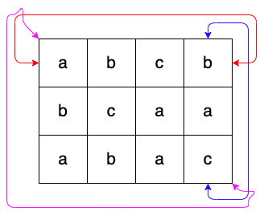

# 문자열 지옥에 빠진 호석

**골드 5**

|시간 제한|	메모리 제한	|제출	|정답	|맞힌 사람|	정답 비율|
|---|---|---|---|---|---|
|1 초|	512 MB	|1769|	633|	441	|33.949%|

## 문제 

하루 종일 내리는 비에 세상이 출렁이고 구름이 해를 먹어 밤인지 낮인지 모르는 어느 여름 날

잠 들기 싫어 버티던 호석이는 무거운 눈꺼풀에 패배했다. 정신을 차려보니 바닥에는 격자 모양의 타일이 가득한 세상이었고, 각 타일마다 알파벳 소문자가 하나씩 써있다더라. 두려움에 가득해 미친듯이 앞만 보고 달려 끝을 찾아 헤맸지만 이 세상은 끝이 없었고, 달리다 지쳐 바닥에 드러누우니 하늘에 이런 문구가 핏빛 구름으로 떠다니고 있었다.

- 이 세상은 N행 M열의 격자로 생겼으며, 각 칸에 알파벳이 써있고 환형으로 이어진다. 왼쪽 위를 (1, 1), 오른쪽 아래를 (N, M)이라고 하자.
- 너는 아무 곳에서나 시작해서 상하좌우나 대각선 방향의 칸으로 한 칸씩 이동할 수 있다. 이 때, 이미 지나 왔던 칸들을 다시 방문하는 것은 허용한다.
- 시작하는 격자의 알파벳을 시작으로, 이동할 때마다 각 칸에 써진 알파벳을 이어 붙여서 문자열을 만들 수 있다.
- 이 곳의 신인 내가 좋아하는 문자열을 K 개 알려줄 터이니, 각 문자열 마다 너가 만들 수 있는 경우의 수를 잘 대답해야 너의 세계로 돌아갈 것이다.
- 경우의 수를 셀 때, 방문 순서가 다르면 다른 경우이다. 즉, (1,1)->(1,2) 로 가는 것과 (1,2)->(1,1) 을 가는 것은 서로 다른 경우이다.

호석이는 하늘을 보고서 "환형이 무엇인지는 알려달라!" 며 소리를 지르니 핏빛 구름이 흩어졌다가 모이며 아래와 같은 말을 그렸다.

- 너가 1행에서 위로 가면 N 행으로 가게 되며 반대도 가능하다.
- 너가 1열에서 왼쪽으로 가면 M 열로 가게 되며 반대도 가능하다.
- 대각선 방향에 대해서도 동일한 규칙이 적용된다.
- 하늘에 아래와 같은 그림을 구름으로 그려줄 터이니 이해해 돕도록 하여라.
- 예를 들어서, 너가 (1, 1)에서 위로 가면 (N, 1)이고, 왼쪽으로 가면 (1, M)이며 왼쪽 위 대각선 방향으로 가면 (N, M)인 것이다.



세상을 이루는 격자의 정보와, K 개의 문자열이 주어졌을 때, 호석이가 대답해야 하는 정답을 구해주도록 하자.

## 입력

첫번째 줄에 격자의 크기 N, M과 신이 좋아하는 문자열의 개수 K 가 주어진다.

다음에 N개의 줄에 걸쳐서 M개의 알파벳 소문자가 공백없이 주어진다. 여기서의 첫 번째 줄은 1행의 정보이며, N 번째 줄은 N행의 정보이다.

이어서 K개의 줄에 걸쳐서 신이 좋아하는 문자열이 주어진다. 모두 알파벳 소문자로 이루어져 있다.

## 출력 

K개의 줄에 걸쳐서, 신이 좋아하는 문자열을 만들 수 있는 경우의 수를 순서대로 출력한다.\

## 제한 

- 3 ≤ N, M ≤ 10, N과 M은 자연수이다.
- 1 ≤ K ≤ 1,000, K는 자연수이다.
- 1 ≤ 신이 좋아하는 문자열의 길이 ≤ 5
- 신이 좋아하는 문자열은 중복될 수도 있다.

## 예제 입력 1

```
3 3 2
aaa
aba
aaa
aa
bb
```

## 예제 출력 1

```
56
0
```

## 예제 입력 2

```
3 4 3
abcb
bcaa
abac
aba
abc
cab
```

## 예제 출력 2

```
66
32
38
```

## 풀이 방식

먼저 시작하는 위치는 아무 곳에서나 시작한다고 했으니깐 (0,0) -> (N-1, M-1) 까지 순차적으로 요소들을 확인해야 할 것이다.

K개의 문자열을 입력 받고 각 문자열의 처음 문자와 일치하는 요소를 탐색하면서 일치시 함수를 실행하는 구조로 코드를 구현하면 될 것 같다.

코드 짜는 순서는 다음과 같다.

1. K개의 문자열 Array에 저장
2. Array 요소 마다 격자 요소 순환 탐색 
3. 조건 만족 시 함수 실행 

함수는 현재 상하좌우, 대각선을 전부 허용했기 때문에 현재 위치의 index에서 본인 위치를 중점으로 만든 사각형을 탐색하면 된다.

이때 함수에선 탐색할 문자의 index를 매개 변수로 넘겨 주면 되고, 재귀 함수로 코드를 구현하면 될 것이다.

주어진 문자열의 length에 도달 시에는 마지막 문자만 비교해서 일치 할 경우 경우의 수 변수에 +1을 해준다.

주의활 점은 사각형의 index를 구하는 과정에서 격자의 index를 넘어서는 경우의 처리이다.

1. 재귀 함수
2. 3 x 3 정사각형 반복문 실행(정사각형 index 처리 주의)
3. 주어진 문자열의 length와 일치 할 때 까지 실행
4. 일치 시 -> count + 1

> 3 x 3 정사각형으로 반복문 실행 할 때
>
> i = 0 ~ 2 -> j = 0 ~ 2 실행 
> 
> 반복문 안에서 y += (i - 1) 처리 만약 index를 넘어서면 따로 작업 수행

## 나의 코드

**TLE**

```java
import java.io.BufferedReader;
import java.io.IOException;
import java.io.InputStreamReader;
import java.util.StringTokenizer;

public class Main {
  static int N;
  static int M;

  static int count;
  static char[][] grid;

  static int modifyIdx(int idx, int length) {
    if(idx == length) return 0;
    else if(idx < 0) return length - 1;
    else return idx;
  }

  static void check(String txt, int idx, int y, int x, int length) {
    if(idx == length) {
      count++;
      return;
    }

    int[] ax = {modifyIdx(x - 1, M ), x, modifyIdx(x + 1, M)};
    int[] ay = {modifyIdx(y - 1, N) , y, modifyIdx(y + 1, N)};

    for(int i = 0; i < 3; i++) {
      for(int j = 0; j < 3; j++) {
        if(i != 1 || j != 1)
          if(grid[ay[i]][ax[j]] == txt.charAt(idx)) check(txt, idx + 1, ay[i], ax[j], length);
      }
    }

  }

  public static void main(String[] args) throws IOException {
    BufferedReader br = new BufferedReader(new InputStreamReader(System.in));
    StringTokenizer st = new StringTokenizer(br.readLine());

    // 격자 크기 N, M, K
    N = Integer.parseInt(st.nextToken());
    M = Integer.parseInt(st.nextToken());
    int K = Integer.parseInt(st.nextToken());

    grid = new char[N][M];

    for(int i = 0; i < N; i++) {
      String rowStr = br.readLine();
      for(int j = 0; j < M; j++) {
        grid[i][j] = rowStr.charAt(j);
      }
    }

    for(int god = 0; god < K; god++) {
      count = 0;
      String txt = br.readLine();
      int txtLen = txt.length();
      char startChar = txt.charAt(0);
      for(int i = 0; i < N; i++) {
        for(int j = 0; j < M; j++) {
          if(grid[i][j] == startChar) {
            if(txtLen == 1) count++;
            else check(txt, 0 + 1, i, j, txtLen);
          }
        }
      }
      System.out.println(count);
    }
  }
}

```