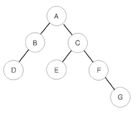

# 트리 순회

**실버 1**

|시간 제한	|메모리 제한|	제출	|정답	|맞힌 사람|	정답 비율|
|---|---|---|---|---|---|
|2 초	|128 MB|	42997|	28132	|21488	|66.430%|

## 문제 

이진 트리를 입력받아 전위 순회(preorder traversal), 중위 순회(inorder traversal), 후위 순회(postorder traversal)한 결과를 출력하는 프로그램을 작성하시오.



예를 들어 위와 같은 이진 트리가 입력되면,

- 전위 순회한 결과 : ABDCEFG // (루트) (왼쪽 자식) (오른쪽 자식)
- 중위 순회한 결과 : DBAECFG // (왼쪽 자식) (루트) (오른쪽 자식)
- 후위 순회한 결과 : DBEGFCA // (왼쪽 자식) (오른쪽 자식) (루트)

## 입력 

첫째 줄에는 이진 트리의 노드의 개수 N(1 ≤ N ≤ 26)이 주어진다. 둘째 줄부터 N개의 줄에 걸쳐 각 노드와 그의 왼쪽 자식 노드, 오른쪽 자식 노드가 주어진다. 노드의 이름은 A부터 차례대로 알파벳 대문자로 매겨지며, 항상 A가 루트 노드가 된다. 자식 노드가 없는 경우에는 .으로 표현한다.

## 출력 

첫째 줄에 전위 순회, 둘째 줄에 중위 순회, 셋째 줄에 후위 순회한 결과를 출력한다. 각 줄에 N개의 알파벳을 공백 없이 출력하면 된다.

## 예제 입력 1

```
7
A B C
B D .
C E F
E . .
F . G
D . .
G . .
```

## 예제 출력 1

```
ABDCEFG
DBAECFG
DBEGFCA
```

## 코드 

**AC**

```java
import java.io.*;
import java.util.StringTokenizer;

public class Main {
  public static void main(String[] args) throws IOException {
    BufferedReader br = new BufferedReader(new InputStreamReader(System.in));
    BufferedWriter bw = new BufferedWriter(new OutputStreamWriter(System.out));

    int N = Integer.parseInt(br.readLine());

    char[][] tree = new char[26][2];
    for (int i = 0; i < N; i++) {
      String nodes = br.readLine();
      int parNode = nodes.charAt(0) - 'A';
      tree[parNode][0] = nodes.charAt(2);
      tree[parNode][1] = nodes.charAt(4);
    }

    preOrder(tree, 'A');

    System.out.println();

    inOrder(tree, 'A');

    System.out.println();

    postOrder(tree, 'A');


  }
  static int charToInt(char c) {
    return c - 'A';
  }

  static void preOrder(char[][] tree, char node) {
    int idx = charToInt(node);
    if (idx < 0 || idx > 26) return;
    System.out.print(node);
    preOrder(tree, tree[idx][0]);
    preOrder(tree, tree[idx][1]);
  }

  static void inOrder(char[][] tree, char node) {
    int idx = charToInt(node);
    if (idx < 0 || idx > 26) return;
    inOrder(tree, tree[idx][0]);
    System.out.print(node);
    inOrder(tree, tree[idx][1]);
  }

  static void postOrder(char[][] tree, char node) {
    int idx = charToInt(node);
    if (idx < 0 || idx > 26) return;
    postOrder(tree, tree[idx][0]);
    postOrder(tree, tree[idx][1]);
    System.out.print(node);
  }
}
```