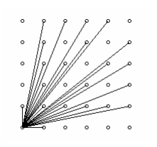

# 보이는 점의 개수

**실버2**

|시간 제한	|메모리 제한|	제출|	정답|	맞힌 사람|	정답 비율|
|---|---|---|---|---|---|
|1 초|	128 MB	|2457|	1308|	1000|	53.220%|

## 문제

(0,0)에서 보이는 (x,y)의 개수를 구하려고 한다.(x,y >= 0, 정수)

(0,0)에서 (x,y)가 보이려면 (0,0)과 (x,y)를 연결하는 직선이 다른 점을 통과하지 않아야 한다. 예를 들어 (4,2)는 (0,0)에서 보이지 않는다. 그 이유는 (0,0)과 (4,2)를 연결하는 직선이 (2,1)을 통과하기 때문이다. 아래 그림은 0 <= x,y<=5인 경우에 (0,0)에서 보이는 점의 개수이다. 단, (0,0)은 계산하지 않는다.



N이 주어졌을 때, 원점에서 보이는 (x,y) 좌표의 개수를 출력하시오. (0 <= x,y <= N)

## 입력

첫째 줄에 테스트 케이스의 개수 C(1<=C<=1,000)가 주어진다. 각 테스트 케이스는 자연수 N(1<=N<=1,000) 하나로 이루어져 있고, 한 줄에 하나씩 주어진다.

## 출력

각 테스트 케이스에 대해 한 줄에 하나씩 (0,0)에서 보이는 점(x,y)의 개수를 출력한다.

## 예제 입력 1

```
4
2
4
5
231
```

## 예제 출력 1

```
5
13
21
32549
```

## 문제 접근

해당 문제는 유클리드 호제법의 확장판이라고 생각이 된다.

임의의 한점 (a,b)가 있다고 할 때 이것이 (0,0)과 선을 그엇을 때 그 사이에 아무런 점도 없을 조건은 무엇일까?

그것은 **둘의 최소 공약수가 1**이 나오면 된다. 

즉, 직선 사이에 점이 있으려면 a,b가 일정한 비율로 나눴을 때 자연수로 맞아 떨어져야 한다.

간단히 말하면, **똑같은 숫자로 나눴을 때 둘다 자연수가 나와야 되는 것**이다. 

그러한 조건은 1이 아닌 최대 공약수가 존재 해야 한다는 것이다.

## 나의 풀이 

**TLE**

```java
import java.io.BufferedReader;
import java.io.IOException;
import java.io.InputStreamReader;
import java.util.StringTokenizer;

public class Main {
  public static void main(String[] args) throws IOException {
    BufferedReader br = new BufferedReader(new InputStreamReader(System.in));

    // Test Case
    int tc = Integer.parseInt(br.readLine());
    for(int counter = 0; counter < tc; counter++) {
      int N = Integer.parseInt(br.readLine());

      int canSeePoints = 0;
      // (0,0) -> (N,N) 이은 직선 기준 한 쪽만 Processing
      for(int i = 2; i <= N; i++) {
        for(int j = 1; j < i; j++) {
          if(Euclidean(i, j, true)) canSeePoints++;
        }
      }
      canSeePoints *= 2;
      if(N >= 1) {
        canSeePoints += 3;
      }
      System.out.println(canSeePoints);
    }

  }
  // 서로수 확인 (서로수인 경우 true)
  static boolean Euclidean(int x, int y, boolean first) {
    if(first && x == 1 || y == 1) return true;

    if(y == 0){
      if(x <= 1)
        return true;
      else
        return false;
    }
    else
      return Euclidean(y, x % y, false);
  }
}

```