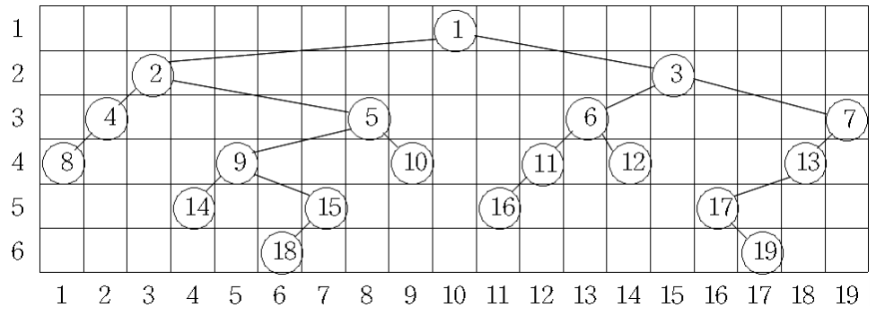

# 트리의 높이와 너비

**골드 2**

|시간 제한	|메모리 제한|	제출|	정답	|맞힌 사람|	정답 비율|
|---|---|---|---|---|---|
|2 초	|128 MB|	18334|	5282|	3634|	27.627%|

## 문제 

이진트리를 다음의 규칙에 따라 행과 열에 번호가 붙어있는 격자 모양의 틀 속에 그리려고 한다. 이때 다음의 규칙에 따라 그리려고 한다.

1. 이진트리에서 같은 레벨(level)에 있는 노드는 같은 행에 위치한다.
2. 한 열에는 한 노드만 존재한다.
3. 임의의 노드의 왼쪽 부트리(left subtree)에 있는 노드들은 해당 노드보다 왼쪽의 열에 위치하고, 오른쪽 부트리(right subtree)에 있는 노드들은 해당 노드보다 오른쪽의 열에 위치한다.
4. 노드가 배치된 가장 왼쪽 열과 오른쪽 열 사이엔 아무 노드도 없이 비어있는 열은 없다.
이와 같은 규칙에 따라 이진트리를 그릴 때 각 레벨의 너비는 그 레벨에 할당된 노드 중 가장 오른쪽에 위치한 노드의 열 번호에서 가장 왼쪽에 위치한 노드의 열 번호를 뺀 값 더하기 1로 정의한다. 트리의 레벨은 가장 위쪽에 있는 루트 노드가 1이고 아래로 1씩 증가한다.

아래 그림은 어떤 이진트리를 위의 규칙에 따라 그려 본 것이다. 첫 번째 레벨의 너비는 1, 두 번째 레벨의 너비는 13, 3번째, 4번째 레벨의 너비는 각각 18이고, 5번째 레벨의 너비는 13이며, 그리고 6번째 레벨의 너비는 12이다.



우리는 주어진 이진트리를 위의 규칙에 따라 그릴 때에 너비가 가장 넓은 레벨과 그 레벨의 너비를 계산하려고 한다. 위의 그림의 예에서 너비가 가장 넓은 레벨은 3번째와 4번째로 그 너비는 18이다. 너비가 가장 넓은 레벨이 두 개 이상 있을 때는 번호가 작은 레벨을 답으로 한다. 그러므로 이 예에 대한 답은 레벨은 3이고, 너비는 18이다.

임의의 이진트리가 입력으로 주어질 때 너비가 가장 넓은 레벨과 그 레벨의 너비를 출력하는 프로그램을 작성하시오

## 입력 

첫째 줄에 노드의 개수를 나타내는 정수 N(1 ≤ N ≤ 10,000)이 주어진다. 다음 N개의 줄에는 각 줄마다 노드 번호와 해당 노드의 왼쪽 자식 노드와 오른쪽 자식 노드의 번호가 순서대로 주어진다. 노드들의 번호는 1부터 N까지이며, 자식이 없는 경우에는 자식 노드의 번호에 -1이 주어진다.

## 출력 

첫째 줄에 너비가 가장 넓은 레벨과 그 레벨의 너비를 순서대로 출력한다. 너비가 가장 넓은 레벨이 두 개 이상 있을 때에는 번호가 작은 레벨을 출력한다.

## 예제 입력 1

```
19
1 2 3
2 4 5
3 6 7
4 8 -1
5 9 10
6 11 12
7 13 -1
8 -1 -1
9 14 15
10 -1 -1
11 16 -1
12 -1 -1
13 17 -1
14 -1 -1
15 18 -1
16 -1 -1
17 -1 19
18 -1 -1
19 -1 -1
```

## 예제 출력 1

```
3 18
```

## 힌트 

실제 기출문제의 문제 제목은 "이진트리의 너비" 이다.

## 풀이 방식 

index값을 level로 갖는 Node형 배열을 하나 생성해준다.

Node에는 노드의 번호를 넣어주는 val, 몇번째 열에 있는지 넣어줄 col 변수들을 만들어 준다.

다음은 탐색 방식인데 생각한 것은 DFS와 중위 순환이다. 생각해봤을 때는 중위 순환이 더 좋아 보이기에 중위 순환으로 풀기로 했다

중위 순환은 다음과 같은 방식으로 진행하면 될 것 같다.

1. 중위 순환을 하면서 노드를 출력하는 부분에선 출력 대신 다음 동작들을 수행한다.
   1. 정적 변수로 col을 생성해 놓아준다. 
   2. Node를 생성후 해당 행에 맞게 level배열에 넣어준다.
   3. col값에 +1을 더해준다.
2. 이후 순환하면서 이와 같은 방식을 전부 하면 순환이 마무리가 된다.

그 이후 부턴 각 행에서의 가장 넓은 너비를 찾으면 되는데 이것은 각 레벨의 처음 인덱스 요소와 마지막 인덱스 요소 이 두개의 너비일 것이다.

## 코드 

**WA**

```java
import java.io.BufferedReader;
import java.io.IOException;
import java.io.InputStreamReader;
import java.util.ArrayList;
import java.util.StringTokenizer;

public class Main {
  static int col = 1;
  public static void main(String[] args) throws IOException {
    BufferedReader br = new BufferedReader(new InputStreamReader(System.in));
    StringTokenizer st;

    int N = Integer.parseInt(br.readLine());
    int[][] graph = new int[N + 1][2];
    for (int i = 1 ; i <= N; i++) {
      st = new StringTokenizer(br.readLine());

      int parNode = Integer.parseInt(st.nextToken());
      int leftNode = Integer.parseInt(st.nextToken());
      int rightNode = Integer.parseInt(st.nextToken());

      graph[parNode][0] = leftNode;
      graph[parNode][1] = rightNode;
    }

    ArrayList<Node>[] level = new ArrayList[N + 1];
    for (int i = 0 ; i < N + 1; i++) {
      level[i] = new ArrayList<>();
    }

    inOrder(graph, 1, 1, level);

    int i = 1;
    int maxLevel = 0;
    int maxWidth = 0;
    while (!level[i].isEmpty()) {
      int size = level[i].size();
      if (size >= 2) {
        int width = level[i].get(size - 1).col - level[i].get(0).col + 1;
        if (maxWidth < width) {
          maxLevel = i;
          maxWidth = width;
        }
      }
      i++;
    }
    System.out.print(maxLevel + " " + maxWidth);
  }
  static void inOrder(int[][] graph, int node, int row, ArrayList<Node>[] level) {
    if(node != -1) {
      inOrder(graph, graph[node][0], row + 1, level);
      level[row].add(new Node(node, col++));
      inOrder(graph, graph[node][1], row + 1, level);
    }
  }
}

class Node {
  int val;
  int col;

  Node(int val, int col) {
    this.val = val;
    this.col = col;
  }
}

```

문제에서는 루트 노드가 1번 노드라는 것에 대한 언급이 나와 있지 않다. 따라서, **루트 노드를 구해야 합니다.**

**RE(ArrayIndexOutOfBounds)**

```java
import java.io.BufferedReader;
import java.io.IOException;
import java.io.InputStreamReader;
import java.util.ArrayList;
import java.util.Arrays;
import java.util.StringTokenizer;

public class Main {
  static int col = 1;
  public static void main(String[] args) throws IOException {
    BufferedReader br = new BufferedReader(new InputStreamReader(System.in));
    StringTokenizer st;

    int N = Integer.parseInt(br.readLine());
    int[] isRootNode = new int[N + 1];
    int[][] graph = new int[N + 1][2];
    for (int i = 1 ; i <= N; i++) {
      st = new StringTokenizer(br.readLine());

      int parNode = Integer.parseInt(st.nextToken());
      int leftNode = Integer.parseInt(st.nextToken());
      int rightNode = Integer.parseInt(st.nextToken());

      if (leftNode != -1) isRootNode[leftNode]++;
      if (rightNode != -1) isRootNode[rightNode]++;

      graph[parNode][0] = leftNode;
      graph[parNode][1] = rightNode;
    }

    int rootNode = 0;
    for (int i = 1; i <= N; i++) {
      if (isRootNode[i] == 0) {
        rootNode = i;
        break;
      }
    }

    ArrayList<Node>[] level = new ArrayList[N + 1];
    for (int i = 0 ; i < N + 1; i++) {
      level[i] = new ArrayList<>();
    }

    inOrder(graph, rootNode, 1, level);

    int i = 1;
    int maxLevel = 0;
    int maxWidth = 0;
    while (!level[i].isEmpty()) {
      int size = level[i].size();
      if (size >= 2) {
        int width = level[i].get(size - 1).col - level[i].get(0).col + 1;
        if (maxWidth < width) {
          maxLevel = i;
          maxWidth = width;
        }
      }
      i++;
    }

    System.out.print(maxLevel + " " + maxWidth);
  }
  static void inOrder(int[][] graph, int node, int row, ArrayList<Node>[] level) {
    if(node != -1) {
      inOrder(graph, graph[node][0], row + 1, level);
      level[row].add(new Node(node, col++));
      inOrder(graph, graph[node][1], row + 1, level);
    }
  }

}

class Node {
  int val;
  int col;

  Node(int val, int col) {
    this.val = val;
    this.col = col;
  }
}

```

```java
    while (!level[i].isEmpty()) {
      int size = level[i].size();
      if (size >= 2) {
        int width = level[i].get(size - 1).col - level[i].get(0).col + 1;
        if (maxWidth < width) {
          maxLevel = i;
          maxWidth = width;
        }
      }
      i++;
    }
```

해당 부분에서 오류가 나왔다. 생각해보면 while문을 사용할 때 가장 기본적으로 주의 해야하는 것이 index범위이다.

또한 잘 찾아 보면 문제에서 주어진 트리의 각 레벨에 노드가 하나씩 밖에 없을 경우에 어떻게 처리해야 되는지 문제의 설명안에 적혀 있다.

**AC**

```java
import java.io.BufferedReader;
import java.io.IOException;
import java.io.InputStreamReader;
import java.util.ArrayList;
import java.util.Arrays;
import java.util.StringTokenizer;

public class Main {
  static int col = 1;
  public static void main(String[] args) throws IOException {
    BufferedReader br = new BufferedReader(new InputStreamReader(System.in));
    StringTokenizer st;

    int N = Integer.parseInt(br.readLine());
    int[] isRootNode = new int[N + 1];
    int[][] graph = new int[N + 1][2];
    for (int i = 1 ; i <= N; i++) {
      st = new StringTokenizer(br.readLine());

      int parNode = Integer.parseInt(st.nextToken());
      int leftNode = Integer.parseInt(st.nextToken());
      int rightNode = Integer.parseInt(st.nextToken());

      if (leftNode != -1) isRootNode[leftNode]++;
      if (rightNode != -1) isRootNode[rightNode]++;

      graph[parNode][0] = leftNode;
      graph[parNode][1] = rightNode;
    }

    int rootNode = 0;
    for (int i = 1; i <= N; i++) {
      if (isRootNode[i] == 0) {
        rootNode = i;
        break;
      }
    }

    ArrayList<Node>[] level = new ArrayList[N + 1];
    for (int i = 0 ; i < N + 1; i++) {
      level[i] = new ArrayList<>();
    }

    inOrder(graph, rootNode, 1, level);

    int i = 1;
    int maxLevel = 1;
    int maxWidth = 1;
    while (i <= N && !level[i].isEmpty()) {
      int size = level[i].size();
      if (size >= 2) {
        int width = level[i].get(size - 1).col - level[i].get(0).col + 1;
        if (maxWidth < width) {
          maxLevel = i;
          maxWidth = width;
        }
      }
      i++;
    }

    System.out.print(maxLevel + " " + maxWidth);
  }
  static void inOrder(int[][] graph, int node, int row, ArrayList<Node>[] level) {
    if(node != -1) {
      inOrder(graph, graph[node][0], row + 1, level);
      level[row].add(new Node(node, col++));
      inOrder(graph, graph[node][1], row + 1, level);
    }
  }

}

class Node {
  int val;
  int col;

  Node(int val, int col) {
    this.val = val;
    this.col = col;
  }
}

```