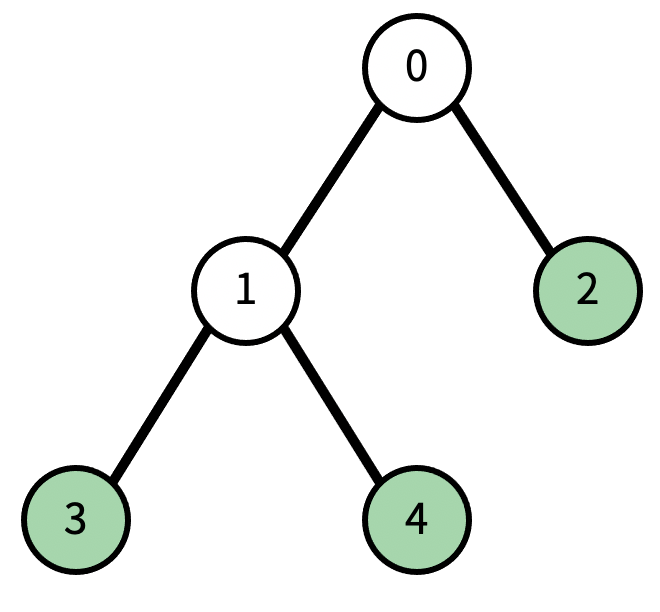

# 트리

**골드 5**

|시간 제한	|메모리 제한|	제출|	정답	|맞힌 사람	|정답 비율|
|---|---|---|---|---|---|
|2 초|	128 MB|	42285	|11894	|9111|	28.147%|

## 문제

트리에서 리프 노드란, 자식의 개수가 0인 노드를 말한다.

트리가 주어졌을 때, 노드 하나를 지울 것이다. 그 때, 남은 트리에서 리프 노드의 개수를 구하는 프로그램을 작성하시오. 노드를 지우면 그 노드와 노드의 모든 자손이 트리에서 제거된다.

예를 들어, 다음과 같은 트리가 있다고 하자.



현재 리프 노드의 개수는 3개이다. (초록색 색칠된 노드) 이때, 1번을 지우면, 다음과 같이 변한다. 검정색으로 색칠된 노드가 트리에서 제거된 노드이다.


이제 리프 노드의 개수는 1개이다.

## 입력 

첫째 줄에 트리의 노드의 개수 N이 주어진다. N은 50보다 작거나 같은 자연수이다. 둘째 줄에는 0번 노드부터 N-1번 노드까지, 각 노드의 부모가 주어진다. 만약 부모가 없다면 (루트) -1이 주어진다. 셋째 줄에는 지울 노드의 번호가 주어진다.

## 출력 

첫째 줄에 입력으로 주어진 트리에서 입력으로 주어진 노드를 지웠을 때, 리프 노드의 개수를 출력한다.

## 예제 입력 1

```
5
-1 0 0 1 1
2
```

## 예제 출력 1

```
2
```

## 예제 입력 2

```
5
-1 0 0 1 1
1
```

## 예제 출력 2

```
1
```

## 예제 입력 3

```
5
-1 0 0 1 1
0
```

## 예제 출격 3

```
0
```

## 예제 입력 4

```
9
-1 0 0 2 2 4 4 6 6
4
```

## 예제 출력 4

```
2
```

## 코드 

**WA**

```java
import java.io.BufferedReader;
import java.io.IOException;
import java.io.InputStreamReader;
import java.util.StringTokenizer;

public class Main {
  public static void main(String[] args) throws IOException {
    BufferedReader br = new BufferedReader(new InputStreamReader(System.in));

    int N = Integer.parseInt(br.readLine());

    int[][] tree= new int[N][2];

    for (int i = 0 ; i < N; i++) {
      tree[i][0] = -1;
      tree[i][1] = -1;
    }

    StringTokenizer st = new StringTokenizer(br.readLine());

    int idx = 0;
    int parNode = 0;
    while (st.hasMoreTokens()) {
      int node = Integer.parseInt(st.nextToken());
      if (node == -1) {
        parNode = idx++;
        continue;
      }
      if (tree[node][0] == -1) {
        tree[node][0] = idx++;
      }
      else {
        tree[node][1] = idx++;
      }
    }

    int deleteNode = Integer.parseInt(br.readLine());

    boolean[] isVisited = new boolean[N];


    // 삭제할 노드를 방문 처리 하면서 노드 삭제 처리
    isVisited[deleteNode] = true;

    // 삭제할 노드 = 루트 노드 => 탐색 X
    if (parNode != deleteNode) {
      findLeafNode(tree, parNode, isVisited);
    }

    System.out.println(leafNodeCount);
  }
  static int leafNodeCount = 0;
  static void findLeafNode(int[][] tree, int curNode, boolean[] isVisited) {

    isVisited[curNode] = true;

    boolean hasChildNode = false;
    for (int childNode : tree[curNode]) {
      if (childNode >= 0 && !isVisited[childNode]) {
        hasChildNode = true;
        findLeafNode(tree, childNode, isVisited);
      }
    }
    if (!hasChildNode) leafNodeCount++;

  }
}
```

**반례**

```
//입력 
7
3 6 6 -1 0 6 3
4

// 정답
4

// 나의 코드 출력 
3
```
```
// 입력 
12
-1 0 0 2 2 2 4 3 3 8 8 8
4

// 출력 
6

// 나의 코드 출력 
5
```