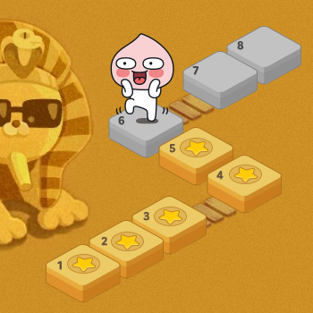

# 실패율

## 문제설명 



슈퍼 게임 개발자 오렐리는 큰 고민에 빠졌다. 그녀가 만든 프랜즈 오천성이 대성공을 거뒀지만, 요즘 신규 사용자의 수가 급감한 것이다. 원인은 신규 사용자와 기존 사용자 사이에 스테이지 차이가 너무 큰 것이 문제였다.

이 문제를 어떻게 할까 고민 한 그녀는 동적으로 게임 시간을 늘려서 난이도를 조절하기로 했다. 역시 슈퍼 개발자라 대부분의 로직은 쉽게 구현했지만, 실패율을 구하는 부분에서 위기에 빠지고 말았다. 오렐리를 위해 실패율을 구하는 코드를 완성하라.

- 실패율은 다음과 같이 정의한다.
  - 스테이지에 도달했으나 아직 클리어하지 못한 플레이어의 수 / 스테이지에 도달한 플레이어 수

전체 스테이지의 개수 N, 게임을 이용하는 사용자가 현재 멈춰있는 스테이지의 번호가 담긴 배열 stages가 매개변수로 주어질 때, 실패율이 높은 스테이지부터 내림차순으로 스테이지의 번호가 담겨있는 배열을 return 하도록 solution 함수를 완성하라.

## 제한사항

- 스테이지의 개수 N은 1 이상 500 이하의 자연수이다.
- stages의 길이는 1 이상 200,000 이하이다.
- stages에는 1 이상 N + 1 이하의 자연수가 담겨있다.
  - 각 자연수는 사용자가 현재 도전 중인 스테이지의 번호를 나타낸다.
  - 단, N + 1 은 마지막 스테이지(N 번째 스테이지) 까지 클리어 한 사용자를 나타낸다.
- 만약 실패율이 같은 스테이지가 있다면 작은 번호의 스테이지가 먼저 오도록 하면 된다.
- 스테이지에 도달한 유저가 없는 경우 해당 스테이지의 실패율은 0 으로 정의한다

## 입출력 예

- 입력값: 5, {2, 1, 2, 6, 2, 4, 3, 3}
  - 기댓값: {3, 4, 2, 1, 5}

- 입력값: 4, {4, 4, 4, 4, 4}
  - 기댓값: {4, 1, 2, 3}

|N|	stages|	result|
|---|---|---|
|5|	[2, 1, 2, 6, 2, 4, 3, 3]|	[3,4,2,1,5]|
|4|	[4,4,4,4,4]	|[4,1,2,3]|

## 입출력 예 설명

**입출력 예 #1**
1번 스테이지에는 총 8명의 사용자가 도전했으며, 이 중 1명의 사용자가 아직 클리어하지 못했다. 따라서 1번 스테이지의 실패율은 다음과 같다.

- 1 번 스테이지 실패율 : 1/8
2번 스테이지에는 총 7명의 사용자가 도전했으며, 이 중 3명의 사용자가 아직 클리어하지 못했다. 따라서 2번 스테이지의 실패율은 다음과 같다.

- 2 번 스테이지 실패율 : 3/7
마찬가지로 나머지 스테이지의 실패율은 다음과 같다.

- 3 번 스테이지 실패율 : 2/4
- 4번 스테이지 실패율 : 1/2
- 5번 스테이지 실패율 : 0/1
각 스테이지의 번호를 실패율의 내림차순으로 정렬하면 다음과 같다.

- [3,4,2,1,5]
입출력 예 #2

모든 사용자가 마지막 스테이지에 있으므로 4번 스테이지의 실패율은 1이며 나머지 스테이지의 실패율은 0이다.

- [4,1,2,3]

## 필요 개념

- Array에서 value의 대소를 비교해 index를 오름차순 혹은 내림차순으로 정리 하는 방법 
- Array를 sort를 사용하지 말고 오름차순 혹은 내림차순으로 정렬하는 방법

## 참고한 사이트

- HashMap
  - https://coding-factory.tistory.com/556

- Map - 점프 투 자바
  - https://wikidocs.net/208

- Map이란?
  - https://devlogofchris.tistory.com/41

- List Double
  - https://derveljunit.tistory.com/321

## 오류 잡기

```java
...

        int[] answer = new int[N];
        double[] rate = new double[N];
        int user = stages.length;
        
    for(int i = 0; i < N; i++) {
      int count = 0;
      int stage = i + 1;
      for(int j = 0; j < stages.length; j++) {
        if(stages[j] == stage) {
          count++;
        }
      }
      rate[i] = count/user;
      user -= count;
    }
```

이와 같은 식으로 코드를 구현했는데, 

    rate[i] = count/user;

해당 코드가 재대로 작동하지 않는다. 이유가 무엇일까?

count와 user은 int형 자료형이기 때문에 둘이 나누었을 때 버림 처리가 되어서 0.0으로 나오는 것이다.

```java
import java.util.Arrays;

class Solution {
  public int[] solution(int N, int[] stages) {
    int[] answer = new int[N];
    double[] rate = new double[N];
    int user = stages.length;


    for(int i = 0; i < N; i++) {
      int count = 0;
      int stage = i + 1;
      for(int j = 0; j < stages.length; j++) {
        if(stages[j] == stage) {
          count++;
        }
      }
      rate[i] = (double)count/(double)user;
      user -= count;
    }

    for(int i = 0; i < rate.length; i++) {
      int index = i;
      for(int j = i + 1; j < rate.length; j++) {
        if(rate[i] < rate[j]) {
          index = j;
          double temp;
          temp = rate[j];
          rate[j] = rate[i];
          rate[i] = temp;
        }
      }
      answer[i] = index + 1;
    }

    return answer;
  }

  public static void main(String[] args) {
    Solution solution = new Solution();
    int N = 5;
    int[] stages = {2, 1, 2, 6, 2, 4, 3, 3};

    int[] array = solution.solution(N, stages);
    for(int i = 0; i < array.length; i++) {
      if(i < array.length -1 ) System.out.print(array[i] +", ");
      else System.out.println(array[i]);
    }
  }
}

```

해당 코드로 실행했을 때 기댓값이 3, 4, 2, 1, 5 이지만
출력값이 3, 4, 4, 4, 5로 나와서 문제점을 찾은 결과

순서를 재 배치 할 때 작은 숫자라 뒤로 갈 때 원래의 Index가 아닌 바뀐 Index로 되어 버리기 때문에 오류가 있다.