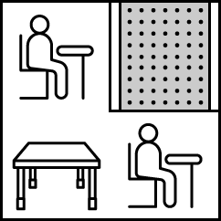

# 거리두기 확인하기

## 문제설명

개발자를 희망하는 죠르디가 카카오에 면접을 보러 왔습니다.

코로나 바이러스 감염 예방을 위해 응시자들은 거리를 둬서 대기를 해야하는데 개발 직군 면접인 만큼
아래와 같은 규칙으로 대기실에 거리를 두고 앉도록 안내하고 있습니다.

1. 대기실은 5개이며, 각 대기실은 5x5 크기입니다.
2. 거리두기를 위하여 응시자들 끼리는 맨해튼 거리1가 2 이하로 앉지 말아 주세요.
3. 단 응시자가 앉아있는 자리 사이가 파티션으로 막혀 있을 경우에는 허용합니다.

예를 들어,

|                                          |                                |                                                     |
|---------------------------------------------------------|-----------------------------------------------|--------------------------------------------------------------------|
| 위 그림처럼 자리 사이에 파티션이 존재한다면 맨해튼 거리가 2여도 거리두기를 **지킨 것입니다.** | 	위 그림처럼 파티션을 사이에 두고 앉은 경우도 거리두기를 **지킨 것입니다.** | 	위 그림처럼 자리 사이가 맨해튼 거리 2이고 사이에 빈 테이블이 있는 경우는 거리두기를 **지키지 않은 것입니다.** |
|                                          |                                |                                                     |
| 응시자가 앉아있는 자리 **(P)** 를 의미합니다.                           | 빈 테이블 **(O)** 을 의미합니다.                        | 파티션 **(X)** 을 의미합니다.                                               |


5개의 대기실을 본 죠르디는 각 대기실에서 응시자들이 거리두기를 잘 기키고 있는지 알고 싶어졌습니다. 자리에 앉아있는 응시자들의 정보와 대기실 구조를 대기실별로 담은 2차원 문자열 배열 ```places```가 매개변수로 주어집니다. 각 대기실별로 거리두기를 지키고 있으면 1을, 한 명이라도 지키지 않고 있으면 0을 배열에 담아 return 하도록 solution 함수를 완성해 주세요.

## 제한사항

- ```places```의 행 길이(대기실 개수) = 5
  - ```places```의 각 행은 하나의 대기실 구조를 나타냅니다.
- ```places```의 열 길이(대기실 세로 길이) = 5
- ```places```의 원소는 ```P```,```O```,```X```로 이루어진 문자열입니다.
  - ```places``` 원소의 길이(대기실 가로 길이) = 5
  - ```P```는 응시자가 앉아있는 자리를 의미합니다.
  - ```O```는 빈 테이블을 의미합니다.
  - ```X```는 파티션을 의미합니다.
- 입력으로 주어지는 5개 대기실의 크기는 모두 5x5 입니다.
- return 값 형식
  - 1차원 정수 배열에 5개의 원소를 담아서 return 합니다.
  - ```places```에 담겨 있는 5개 대기실의 순서대로, 거리두기 준수 여부를 차례대로 배열에 담습니다.
  - 각 대기실 별로 모든 응시자가 거리두기를 지키고 있으면 1을, 한 명이라도 지키지 않고 있으면 0을 담습니다.

## 입출력 예

- 입력값: {{"POOOP", "OXXOX", "OPXPX", "OOXOX", "POXXP"}, {"POOPX", "OXPXP", "PXXXO", "OXXXO", "OOOPP"}, {"PXOPX", "OXOXP", "OXPOX", "OXXOP", "PXPOX"}, {"OOOXX", "XOOOX", "OOOXX", "OXOOX", "OOOOO"}, {"PXPXP", "XPXPX", "PXPXP", "XPXPX", "PXPXP"}}
  - 기댓값: {1, 0, 1, 1, 1}

| places                                                                                                                                                                                                                                                       | 	result         |
|--------------------------------------------------------------------------------------------------------------------------------------------------------------------------------------------------------------------------------------------------------------|-----------------|
|  [["POOOP", "OXXOX", "OPXPX", "OOXOX", "POXXP"], ["POOPX", "OXPXP", "PXXXO", "OXXXO", "OOOPP"], ["PXOPX", "OXOXP", "OXPOX", "OXXOP", "PXPOX"], ["OOOXX", "XOOOX", "OOOXX", "OXOOX", "OOOOO"], ["PXPXP", "XPXPX", "PXPXP", "XPXPX", "PXPXP"]]	| [1, 0, 1, 1, 1] |

## 입출력 예 설명

**입출력 예 #1**

첫 번째 대기실

|No.	|0	|1	|2	|3	|4|
|---|---|---|---|---|---|
|0	|P	|O	|O	|O	|P|
|1	|O	|X	|X	|O	|X|
|2	|O	|P	|X	|P	|X|
|3	|O	|O	|X	|O	|X|
|4	|P	|O	|X	|X	|P|
- 모든 응시자가 거리두기를 지키고 있습니다.

두 번째 대기실

|No.	|0	|1	|2	| 3	   |4|
|---|---|---|---|------|---|
|0	|**P**	|O	|O	| **P**	 |X|
|1	|O	|X	|**P**	| X	   |P|
|2	|**P**	|X	|X	| X	   |O|
|3	|O	|X	|X	| X	   |O|
|4	|O	|O	|O	| **P**	   |**P**|
- (0, 0) 자리의 응시자와 (2, 0) 자리의 응시자가 거리두기를 지키고 있지 않습니다.
- (1, 2) 자리의 응시자와 (0, 3) 자리의 응시자가 거리두기를 지키고 있지 않습니다.
- (4, 3) 자리의 응시자와 (4, 4) 자리의 응시자가 거리두기를 지키고 있지 않습니다.

세 번째 대기실

|No.|	0|	1|	2|	3|	4|
|---|---|---|---|---|---|
|0|	P|	X|	O|	P|	X|
|1|	O|	X|	O|	X|	P|
|2|	O|	X|	P|	O|	X|
|3|	O|	X|	X|	O|	P|
|4|	P|	X|	P|	O|	X|
- 모든 응시자가 거리두기를 지키고 있습니다.

네 번째 대기실

|No.|	0|	1|	2|	3|	4|
|---|---|---|---|---|---|
|0|	O|	O|	O|	X|	X|
|1|	X|	O|	O|	O|	X|
|2|	O|	O|	O|	X|	X|
|3|	O|	X|	O|	O|	X|
|4|	O|	O|	O|	O|	O|
- 대기실에 응시자가 없으므로 거리두기를 지키고 있습니다.

다섯 번째 대기실

|No.|	0|	1|	2|	3|	4|
|---|---|---|---|---|---|
|0|	P|	X|	P|	X|	P|
|1|	X|	P|	X|	P|	X|
|2|	P|	X|	P|	X|	P|
|3|	X|	P|	X|	P|	X|
|4|	P|	X|	P|	X|	P|

- 모든 응시자가 거리두기를 지키고 있습니다.
두 번째 대기실을 제외한 모든 대기실에서 거리두기가 지켜지고 있으므로, 배열 [1, 0, 1, 1, 1]을 return 합니다.

## 제한시간 안내

정확성 테스트 : 10초

두 테이블 T1, T2가 행렬 (r1, c1), (r2, c2)에 각각 위치하고 있다면, T1, T2 사이의 맨해튼 거리는 |r1 - r2| + |c1 - c2| 입니다. 

## 풀이 과정

해당 문제하는데 막히는 것은 가장자리와 모서리, 안쪽이 체크하는 경우의 수가 다르다는 것이다.

특히 해당 지문에는 거리 2이하인 것을 전부 체크하라는 식으로 써있지만 사실상 가장자리나 모서리 같은 경우 없는 Index를 사용할 경우 코드가 오류가 나올 것이다.

해당 부분을 해결하는 것이 이 문제를 해결하는데 핵심 Point가 될 것이다.

우선 붙어있는 경우는 당연히 거리두기를 지키지 않은 것이니 0이다.

문제는 거리가 2인경우인데 해당 경우는 상하좌우로는 두칸씩 체크해야되고, 대각선도 체크해야된다.

만약 상하좌우중에 P가 있다면 그 사이에 파티션이 있는지 체크해야되고 대각선인경우 양쪽 사이에 파티션이 있는지 체크해야 한다.

기준점을 바꿔서 생각해보자. 'P'를 기준으로 생각하지 말고 파티션을 기준으로 생각을 해보자.

상하좌우중에 파티션 'X'가 아닌 것만 그 이상 거리 2인 것을 확인하면 된다.

혹시나 상하좌우 중에 빈 자리 'O'인 경우 빈자리 기준에서 거리가 1인 곳을 다시 확인 만약 P가 두개라면 거리두기 실패

거리라는 것은 곧 거리 1 + 거리 1 인 것을 인지.

여전히 문제는 없는 Index 처리하는 부분이다.

한 가지 방법은 상하 좌우로 Index크기를 4씩 더 늘려서 상하좌우 Index를 2씩 증가 시키고 X를 넣어준다음 Index 2 ~ 6 까지만 돌리는 방법이 있다.

## 필요 개념
- 함수를 사용할 때 Array의 value값을 매개변수로 받는 법