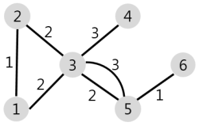

# 배달

## 문제 설명

N개의 마을로 이루어진 나라가 있습니다. 이 나라의 각 마을에는 1부터 N까지의 번호가 각각 하나씩 부여되어 있습니다. 각 마을은 양방향으로 통행할 수 있는 도로로 연결되어 있는데, 서로 다른 마을 간에 이동할 때는 이 도로를 지나야 합니다. 도로를 지날 때 걸리는 시간은 도로별로 다릅니다. 현재 1번 마을에 있는 음식점에서 각 마을로 음식 배달을 하려고 합니다. 각 마을로부터 음식 주문을 받으려고 하는데, N개의 마을 중에서 K 시간 이하로 배달이 가능한 마을에서만 주문을 받으려고 합니다. 다음은 N = 5, K = 3인 경우의 예시입니다.


위 그림에서 1번 마을에 있는 음식점은 [1, 2, 4, 5] 번 마을까지는 3 이하의 시간에 배달할 수 있습니다. 그러나 3번 마을까지는 3시간 이내로 배달할 수 있는 경로가 없으므로 3번 마을에서는 주문을 받지 않습니다. 따라서 1번 마을에 있는 음식점이 배달 주문을 받을 수 있는 마을은 4개가 됩니다.
마을의 개수 N, 각 마을을 연결하는 도로의 정보 road, 음식 배달이 가능한 시간 K가 매개변수로 주어질 때, 음식 주문을 받을 수 있는 마을의 개수를 return 하도록 solution 함수를 완성해주세요.

## 제한사항

- 마을의 개수 N은 1 이상 50 이하의 자연수입니다.
- road의 길이(도로 정보의 개수)는 1 이상 2,000 이하입니다.
- road의 각 원소는 마을을 연결하고 있는 각 도로의 정보를 나타냅니다.
- road는 길이가 3인 배열이며, 순서대로 (a, b, c)를 나타냅니다.
  - a, b(1 ≤ a, b ≤ N, a != b)는 도로가 연결하는 두 마을의 번호이며, c(1 ≤ c ≤ 10,000, c는 자연수)는 도로를 지나는데 걸리는 시간입니다.
  - 두 마을 a, b를 연결하는 도로는 여러 개가 있을 수 있습니다.
  - 한 도로의 정보가 여러 번 중복해서 주어지지 않습니다.
- K는 음식 배달이 가능한 시간을 나타내며, 1 이상 500,000 이하입니다.
- 임의의 두 마을간에 항상 이동 가능한 경로가 존재합니다.
- 1번 마을에 있는 음식점이 K 이하의 시간에 배달이 가능한 마을의 개수를 return 하면 됩니다.

## 입출력 예

- 입력값: 5, {{1, 2, 1}, {2, 3, 3}, {5, 2, 2}, {1, 4, 2}, {5, 3, 1}, {5, 4, 2}}, 3
  - 기댓값: 4
- 입력값: 6, {{1, 2, 1}, {1, 3, 2}, {2, 3, 2}, {3, 4, 3}, {3, 5, 2}, {3, 5, 3}, {5, 6, 1}}, 4
  - 기댓값: 4

|N	|road|	K| 	result |
|---|---|---|---------|
|5|	[[1,2,1],[2,3,3],[5,2,2],[1,4,2],[5,3,1],[5,4,2]]|	3| 	4      |
|6|	[[1,2,1],[1,3,2],[2,3,2],[3,4,3],[3,5,2],[3,5,3],[5,6,1]]|	4| 	4      |

## 입출력 예 설명

**입출력 예 #1**
문제의 예시와 같습니다.

**입출력 예 #2**
주어진 마을과 도로의 모양은 아래 그림과 같습니다.



1번 마을에서 배달에 4시간 이하가 걸리는 마을은 [1, 2, 3, 5] 4개이므로 4를 return 합니다.

## 풀이 과정

정리를 하던 도중 이것이 DFS를 활용해서 풀어야 하는 문제임을 알았다.

하지만, DFS에 익숙하지 않아 백준 사이트로 가서 DFS문제를 더 풀고 다시 오기로 헀다.

## 코드 오류 잡기

```java
import java.util.ArrayList;

class Solution {

  static ArrayList<Integer[]>[] nodeAndCost;
  static boolean[] checkDistance;
  public int solution(int N, int[][] road, int K) {
    int answer = 0;
    checkDistance = new boolean[N + 1];
    nodeAndCost = new ArrayList[N + 1];
    boolean[] visited = new boolean[N + 1];

    for(int i = 0; i < road.length; i++) {
      int node1= road[i][0];
      int node2 = road[i][1];
      int cost = road[i][2];

      if(nodeAndCost[node1] == null) nodeAndCost[node1] = new ArrayList<>();
      if(nodeAndCost[node2] == null) nodeAndCost[node2] = new ArrayList<>();

      nodeAndCost[node1].add(new Integer[]{node2, cost});
      nodeAndCost[node2].add(new Integer[]{node1, cost});
    }

    checkDistance[1] = true;
    for(int i = 2; i < nodeAndCost.length; i++) {
      visited[1] = true;
      dfs(1, i, K, 0, visited);
    }

    for(int i = 1; i < checkDistance.length; i++) {
      if(checkDistance[i]) answer++;
    }

    // [실행] 버튼을 누르면 출력 값을 볼 수 있습니다.
    System.out.println("Hello Java");

    return answer;
  }
  public static void main(String[] args) {
    Solution solution = new Solution();
    int N = 5;
    int[][] road = 	{{1,2,1},{2,3,3},{5,2,2},{1,4,2},{5,3,1},{5,4,2}};
    int K = 3;

    System.out.println(solution.solution(N, road, K));
  }

  static void dfs(int curNode, int targetNode, int K, int cost, boolean[] visited) {

    // 바로 직행 거리에 있는지 체크.
    if(curNode == 1) {
      for(int i = 0; i < nodeAndCost[1].size(); i++) {
        if(targetNode == nodeAndCost[1].get(i)[0]) {
          if(K >= nodeAndCost[1].get(i)[1]) {
            checkDistance[targetNode] = true;
            return;
          }
        }
      }
    }

    if(checkDistance[targetNode] || cost > K) {
      return;
    }

    if(curNode == targetNode) {
      if(cost <= K)  {
        checkDistance[targetNode] = true;
        return;
      }
    }

    for(Integer[] node : nodeAndCost[curNode]) {
      if(!visited[node[0]]) {
        cost += node[1];
        visited[node[0]] = true;
        dfs(node[0], targetNode, K, cost, visited);
      }
    }
  }
}
```

해당 식으로 했을 경우 두 가지 문제가 있다. 

먼저, 이전 백준 문제에서 봤다싶히 재귀함수를 거쳐서 다시 되돌아오는 과정에서 for문에서 적용하지 말아야 되는 것이 무엇인지를 생각해보자.

visited의 경우 for문에 써줄 수 밖에 없는데, 해당 문제의 경우 for문으로 되돌아 오는 과정에서 거쳤던 visited는 다시 false로 되어야 이전으로 다른 루트로 갔을 경우에 문제가 안생긴다.

그리고, cost의 경우에도 되돌아 오는 과정에서 다시 이전 상태로 돌아가야 한다.

그러기 위해선 재귀함수의 매개변수에 적용시키면 된다.

## 필요 개념

- ArrayList.add(index)의 경우 해당 index위치로 들어가면서 기존 index위치에 있던 element는 뒤로 밀려나는 것이다.
- 다익스트라 알고리즘
- 플로이드 와샬
- 다익스트라 알고리즘 vs 플로이드 와샬

## 참고한 사이트
- [알고리즘] Time Complexity (시간 복잡도)
  - https://hanamon.kr/%EC%95%8C%EA%B3%A0%EB%A6%AC%EC%A6%98-time-complexity-%EC%8B%9C%EA%B0%84-%EB%B3%B5%EC%9E%A1%EB%8F%84/ 
- 그래프 - 시간복잡도와 공간복잡도(인접 행렬, 인접리스트)
  - https://codermun-log.tistory.com/288
- 그래와 트리(Graph and Tree)
  - https://bigsong.tistory.com/33
- 선형 탐색 / 이진 탐색 알고리즘
  - https://nittaku.tistory.com/487
- 그래프의 표현
  - https://sskl660.tistory.com/60
- 다익스트라 알고리즘
  - https://sskl660.tistory.com/59
  - https://dding9code.tistory.com/81
- 다익스트라 알고리즘 원리
  - https://haenny.tistory.com/350
- 그리디 알고리즘
  - https://hanamon.kr/%EC%95%8C%EA%B3%A0%EB%A6%AC%EC%A6%98-%ED%83%90%EC%9A%95%EC%95%8C%EA%B3%A0%EB%A6%AC%EC%A6%98-greedy-algorithm/
- 플로이드 워셜
  - https://sskl660.tistory.com/61
- 다익스트라 알고리즘 vs 플로이드 워셜
  - https://zz132456zz.tistory.com/9
- DFS vs BFS
  - https://velog.io/@vagabondms/DFS-vs-BFS
  - https://wikidocs.net/123116
  - https://currygamedev.tistory.com/10
- 최단거리 문제 알고리즘에 대한 궁금증 정리
  - https://jypthemiracle.medium.com/%EC%B5%9C%EB%8B%A8%EA%B1%B0%EB%A6%AC-%EB%AC%B8%EC%A0%9C-%EC%95%8C%EA%B3%A0%EB%A6%AC%EC%A6%98%EC%97%90-%EB%8C%80%ED%95%9C-%EA%B6%81%EA%B8%88%EC%A6%9D-%EC%A0%95%EB%A6%AC-5b1b813ba1b3

## 나의 코드

```java

//TLE

import java.util.ArrayList;

class Solution {

  static ArrayList<Integer[]>[] nodeAndCost;
  static boolean[] checkDistance;
  public int solution(int N, int[][] road, int K) {
    int answer = 0;
    checkDistance = new boolean[N + 1];
    nodeAndCost = new ArrayList[N + 1];
    boolean[] visited = new boolean[N + 1];

    for(int i = 0; i < road.length; i++) {
      int node1= road[i][0];
      int node2 = road[i][1];
      int cost = road[i][2];

      if(nodeAndCost[node1] == null) nodeAndCost[node1] = new ArrayList<>();
      if(nodeAndCost[node2] == null) nodeAndCost[node2] = new ArrayList<>();

      nodeAndCost[node1].add(new Integer[]{node2, cost});
      nodeAndCost[node2].add(new Integer[]{node1, cost});
    }

    checkDistance[1] = true;
    for(int i = 2; i < nodeAndCost.length; i++) {
      visited[1] = true;
      dfs(1, i, K, 0, visited);
    }

    for(int i = 1; i < checkDistance.length; i++) {
      if(checkDistance[i]) answer++;
    }

    // [실행] 버튼을 누르면 출력 값을 볼 수 있습니다.
    System.out.println("Hello Java");

    return answer;
  }
  public static void main(String[] args) {
    Solution solution = new Solution();
    int N = 5;
    int[][] road = 	{{1,2,1},{2,3,3},{5,2,2},{1,4,2},{5,3,1},{5,4,2}};
    int K = 3;

    System.out.println(solution.solution(N, road, K));
  }

  static void dfs(int curNode, int targetNode, int K, int cost, boolean[] visited) {

    // 바로 직행 거리에 있는지 체크.
    if(curNode == 1) {
      for(int i = 0; i < nodeAndCost[1].size(); i++) {
        if(targetNode == nodeAndCost[1].get(i)[0]) {
          if(K >= nodeAndCost[1].get(i)[1]) {
            checkDistance[targetNode] = true;
            return;
          }
        }
      }
    }

    if(checkDistance[targetNode] || cost > K) {
      return;
    }

    if(curNode == targetNode) {
      if(cost <= K)  {
        checkDistance[targetNode] = true;
        return;
      }
    }

    for(Integer[] node : nodeAndCost[curNode]) {
      if(!visited[node[0]]) {
        visited[node[0]] = true;
        dfs(node[0], targetNode, K, cost + node[1], visited);
        visited[node[0]] = false;
      }
    }
  }
}
```

**채점 결과**

정확성: 96.9

합계: 96.9 / 100.0

---

```java

//TLE

import java.util.ArrayList;
import java.util.Collections;

class Solution {

  static ArrayList<Integer[]>[] nodeAndCost;
  static boolean[] checkDistance;
  public int solution(int N, int[][] road, int K) {
    int answer = 0;
    checkDistance = new boolean[N + 1];
    nodeAndCost = new ArrayList[N + 1];
    boolean[] visited = new boolean[N + 1];

    for(int i = 0; i < road.length; i++) {
      int node1= road[i][0];
      int node2 = road[i][1];
      int cost = road[i][2];

      if(nodeAndCost[node1] == null) nodeAndCost[node1] = new ArrayList<>();
      if(nodeAndCost[node2] == null) nodeAndCost[node2] = new ArrayList<>();

      nodeAndCost[node1].add(new Integer[]{node2, cost});
      nodeAndCost[node2].add(new Integer[]{node1, cost});
    }

    for(int i = 1; i < nodeAndCost.length; i++) {
      if(nodeAndCost[i] != null) {
        for(int j = 0; j < nodeAndCost[i].size() - 1; j++) {
          if(nodeAndCost[i].get(j)[1] > nodeAndCost[i].get(j + 1)[1]) {
            Integer[] node = nodeAndCost[i].get(j);
            nodeAndCost[i].remove(j);
            nodeAndCost[i].add(j + 1, node);
          }
        }
      }
    }

    checkDistance[1] = true;
    for(int i = 2; i < nodeAndCost.length; i++) {
      visited[1] = true;
      dfs(1, i, K, 0, visited);
    }

    for(int i = 1; i < checkDistance.length; i++) {
      if(checkDistance[i]) answer++;
    }

    // [실행] 버튼을 누르면 출력 값을 볼 수 있습니다.
    System.out.println("Hello Java");

    return answer;
  }
  public static void main(String[] args) {
    Solution solution = new Solution();
    int N = 5;
    int[][] road = 	{{1,2,1},{2,3,3},{5,2,2},{1,4,2},{5,3,1},{5,4,2}};
    int K = 3;

    System.out.println(solution.solution(N, road, K));
  }

  static void dfs(int curNode, int targetNode, int K, int cost, boolean[] visited) {

    // 바로 직행 거리에 있는지 체크.
    if(curNode == 1) {
      for(int i = 0; i < nodeAndCost[1].size(); i++) {
        if(targetNode == nodeAndCost[1].get(i)[0]) {
          if(K >= nodeAndCost[1].get(i)[1]) {
            checkDistance[targetNode] = true;
            return;
          }
        }
      }
    }

    if(checkDistance[targetNode] || cost > K) {
      return;
    }

    if(curNode == targetNode) {
      if(cost <= K)  {
        checkDistance[targetNode] = true;
        return;
      }
    }

    for(Integer[] node : nodeAndCost[curNode]) {
      if(!visited[node[0]]) {
        visited[node[0]] = true;
        dfs(node[0], targetNode, K, cost + node[1], visited);
        visited[node[0]] = false;
      }
    }
  }
}
```

**채점 결과**

정확성: 96.9

합계: 96.9 / 100.0

---

**Solve Using Dijkstra**

```java
import java.util.ArrayList;
import java.util.Arrays;
import java.util.PriorityQueue;

class Node {
  int idx;
  int cost;

  Node(int idx, int cost) {
    this.idx = idx;
    this.cost = cost;
  }
}
class Solution {
  static int INF = Integer.MAX_VALUE;
  public int solution(int N, int[][] road, int K) {
    int answer = 0;

    ArrayList<Node>[] graph = new ArrayList[N + 1];
    for(int i = 0; i < N + 1 ; i++) {
      graph[i] = new ArrayList<>();
    }

    for(int i = 0; i < road.length; i++) {
      int[] roadInfo = road[i];
      // 양방향 그래프
      graph[roadInfo[0]].add(new Node(roadInfo[1], roadInfo[2]));
      graph[roadInfo[1]].add(new Node(roadInfo[0], roadInfo[2]));
    }

    int[] dist = new int[N + 1];
    Arrays.fill(dist, INF);
    dist[1] = 0;

    answer = DijkStra(K, graph, dist);

    // [실행] 버튼을 누르면 출력 값을 볼 수 있습니다.
    System.out.println("Hello Java");

    return answer;
  }
  static int DijkStra(int K, ArrayList<Node>[] graph, int[] dist) {
    PriorityQueue<Node> q = new PriorityQueue<>((o1, o2) -> Integer.compare(o1.cost, o2.cost));

    q.add(new Node(1, 0));

    while (!q.isEmpty()) {
      Node curNode = q.poll();

      if(dist[curNode.idx] < curNode.cost) continue;

      for(int i = 0; i < graph[curNode.idx].size(); i++) {
        Node adjNode = graph[curNode.idx].get(i);

        if(dist[adjNode.idx] > dist[curNode.idx] + adjNode.cost) {
          dist[adjNode.idx] = dist[curNode.idx] + adjNode.cost;
          q.add(new Node(adjNode.idx, dist[adjNode.idx]));
        }
      }
    }
    int canDelivery = 0;

    for(int i = 1; i < dist.length; i++) {
      if(dist[i] <= K) canDelivery++;
    }

    return canDelivery;
  }

  public static void main(String[] args) {

  }
}
```